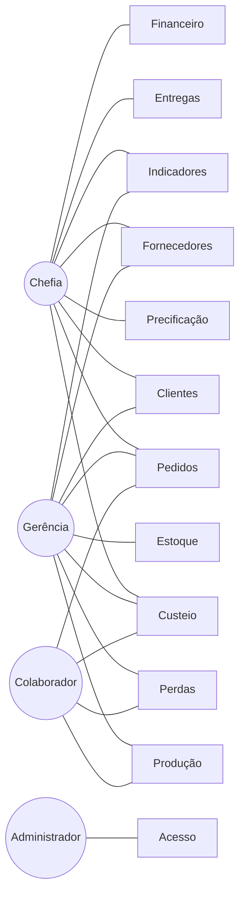
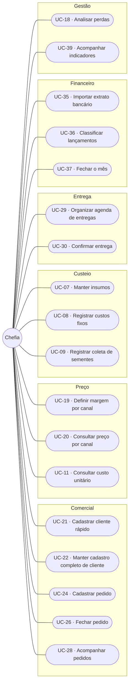
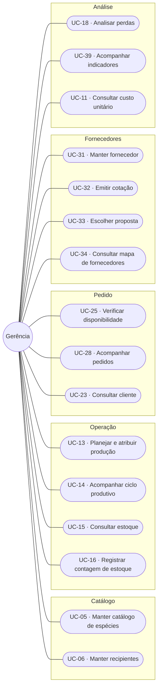
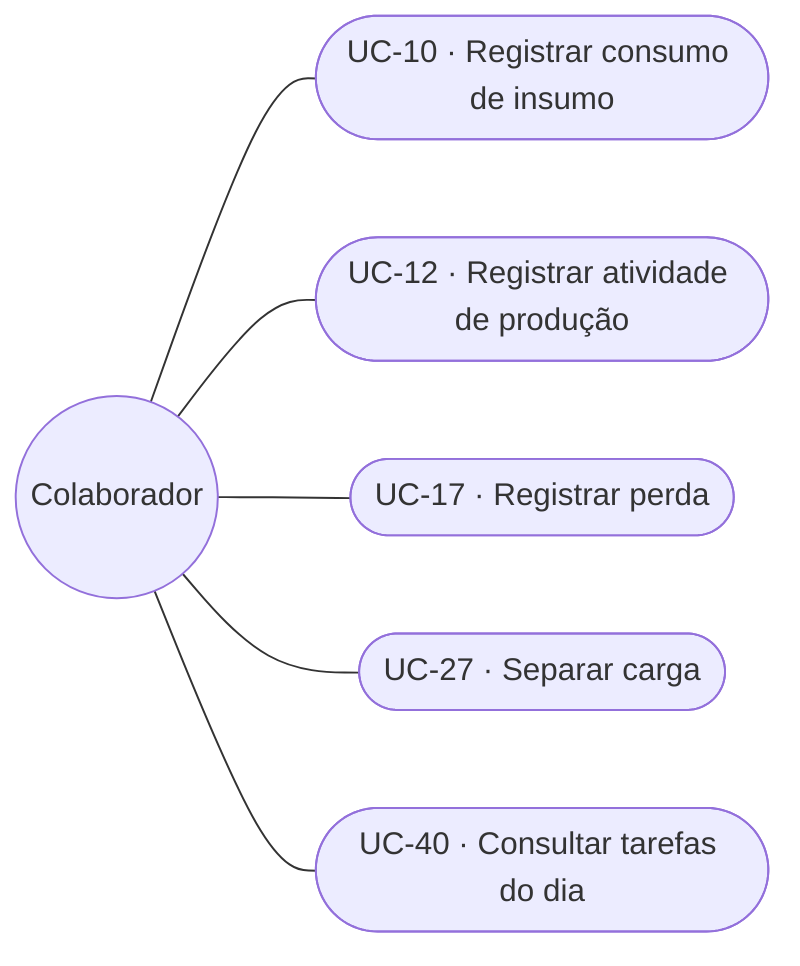
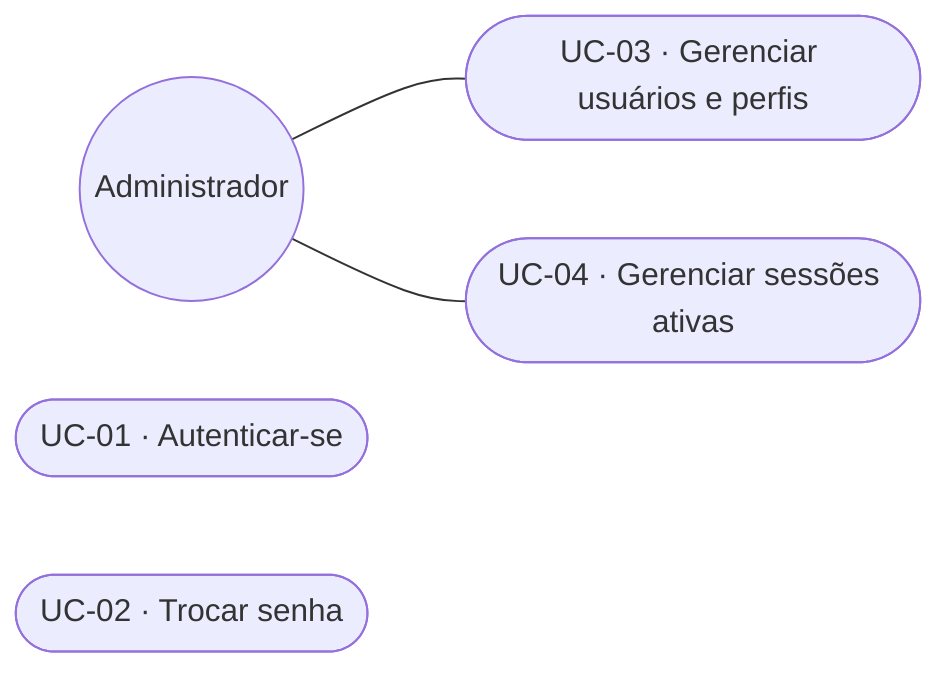

# C1 — Diagrama de casos de uso

> **Artefato:** Diagrama de casos de uso (UML) · **Bloco:** C — Modelagem
> **Destino no TCC:** Capítulo 4, seção 4.3 — Modelagem do sistema
> **Fundamentação:** Sommerville (2011) define o caso de uso como cenário que descreve o que o
> usuário espera do sistema, representando uma interação externa. Pressman e Maxim (2016) indicam
> que a construção parte da **definição dos atores** — todo elemento externo que se comunica com o
> sistema e possui uma meta ao utilizá-lo.

---

## 1. Atores

Os atores derivam diretamente da estrutura organizacional da empresa. A correspondência entre função
real e papel no sistema é a mesma registrada em
[`A1`](../A-fundacao/A1-documento-de-visao.md) e detalhada em
[`D4`](../D-arquitetura/D4-matriz-rbac.md).

| Ator | Meta ao utilizar o sistema | Nº de pessoas |
|---|---|---|
| **Chefia** | Vender com margem conhecida, decidir com base em dado e não em memória | 1 |
| **Gerência** | Coordenar a operação e saber o que existe, o que falta e o que está por vir | 2 |
| **Colaborador** | Registrar o que fez em campo, com o mínimo de interrupção do trabalho | 6 |
| **Administrador** | Manter o sistema operante e o acesso correto | 1 (acumulado pela gerência) |

**Sobre o administrador:** trata-se de **papel técnico**, não de função da empresa. Ele não participa
de nenhuma rotina de negócio e seus casos de uso limitam-se à gestão de usuários e permissões. É
representado à parte para que os casos de uso de negócio reflitam exclusivamente a operação real do
viveiro.

**Atores externos ao sistema** — sistemas com os quais há troca de informação, sem serem operados por
usuário do viveiro: o **emissor de nota fiscal** (sistema fiscal externo, que recebe os dados da
venda e devolve o número da nota), o **serviço de mensageria** (WhatsApp, por onde a negociação
ocorre) e o **serviço de geocodificação** (que converte cidade e estado do fornecedor em coordenadas).

---

## 2. Visão geral — atores e subsistemas

Duas leituras que o diagrama torna imediatas:

- **O colaborador toca quatro subsistemas, sempre pela ponta do registro.** Ele alimenta o sistema e
  não consulta resultado — não acessa preço, custo nem indicador. É o que justifica o rigor dos
  requisitos não funcionais de usabilidade: para esse ator, o sistema **é** o formulário.
- **O financeiro conecta-se a um único ator.** Não é omissão do diagrama, é regra de negócio: a base
  mistura gasto do viveiro com gasto pessoal da família, e o acesso é restrito à chefia.

---

## 3. Casos de uso por ator

### 3.1 Chefia

### 3.2 Gerência

### 3.3 Colaborador

Cinco casos de uso, todos de registro ou consulta operacional. É deliberado: cada caso adicional
atribuído a esse ator aumenta a chance de que nenhum seja executado.

### 3.4 Administrador

**UC-01** e **UC-02** são comuns a todos os atores e, por isso, não se repetem nos diagramas
anteriores: todo caso de uso do sistema tem como pré-condição uma sessão autenticada.

---

## 4. Catálogo completo de casos de uso

A coluna **requisitos** faz a ligação com [`B2`](../B-requisitos/B2-especificacao-requisitos.md) e
alimenta a matriz de rastreabilidade [`B5`](../B-requisitos/B5-matriz-rastreabilidade.md).

| Código | Caso de uso | Ator principal | Requisitos | Detalhado em C2 |
|---|---|---|---|---|
| **UC-01** | Autenticar-se | Todos | RF-01 | — |
| **UC-02** | Trocar senha | Todos | RF-02 | — |
| **UC-03** | Gerenciar usuários e perfis | Administrador | RF-05, RF-06 | — |
| **UC-04** | Gerenciar sessões ativas | Todos | RF-03, RF-04, RF-07 | — |
| **UC-05** | Manter catálogo de espécies | Gerência | RF-08, RF-09 | — |
| **UC-06** | Manter recipientes | Gerência | RF-10 | — |
| **UC-07** | Manter insumos | Chefia | RF-11 | — |
| **UC-08** | Registrar custos fixos | Chefia | RF-12 | — |
| **UC-09** | Registrar coleta de sementes | Chefia | RF-13 | — |
| **UC-10** | Registrar consumo de insumo | Colaborador | RF-14 | — |
| **UC-11** | Consultar custo unitário | Chefia, Gerência | RF-15, RF-16, RF-17, RF-18 | — |
| **UC-12** | Registrar atividade de produção | Colaborador | RF-19 | — |
| **UC-13** | Planejar e atribuir produção | Gerência | RF-20 | — |
| **UC-14** | Acompanhar ciclo produtivo | Gerência | RF-21 | — |
| **UC-15** | Consultar estoque | Chefia, Gerência | RF-22, RF-24 | — |
| **UC-16** | Registrar contagem de estoque | Gerência | RF-23, RF-25 | — |
| **UC-17** | Registrar perda | Colaborador | RF-26 | **✔ sim** |
| **UC-18** | Analisar perdas | Gerência, Chefia | RF-27, RF-28, RF-29, RF-30 | — |
| **UC-19** | Definir margem por canal | Chefia | RF-31 | — |
| **UC-20** | Consultar preço por canal | Chefia, Gerência | RF-32, RF-33, RF-34, RF-35 | — |
| **UC-21** | Cadastrar cliente rápido | Chefia | RF-36 | — |
| **UC-22** | Manter cadastro completo de cliente | Chefia, Gerência | RF-37, RF-38, RF-40 | — |
| **UC-23** | Consultar cliente | Chefia, Gerência | RF-39 | — |
| **UC-24** | Cadastrar pedido | Chefia | RF-41, RF-66, RF-67 | **✔ sim** |
| **UC-25** | Verificar disponibilidade | Gerência | RF-42, RF-43, RF-68 | **✔ sim** |
| **UC-26** | Fechar pedido | Chefia | RF-44, RF-45, RF-46 | **✔ sim** |
| **UC-27** | Separar carga | Colaborador | RF-47 | **✔ sim** |
| **UC-28** | Acompanhar pedidos | Chefia, Gerência | RF-48, RF-49 | — |
| **UC-29** | Organizar agenda de entregas | Chefia | RF-50 | — |
| **UC-30** | Confirmar entrega | Chefia | RF-51 | — |
| **UC-31** | Manter fornecedor | Gerência | RF-52 | — |
| **UC-32** | Emitir cotação | Gerência | RF-53 | **✔ sim** |
| **UC-33** | Escolher proposta | Chefia, Gerência | RF-54 | **✔ sim** |
| **UC-34** | Consultar mapa de fornecedores | Gerência | RF-55 | — |
| **UC-35** | Importar extrato bancário | Chefia | RF-56 | — |
| **UC-36** | Classificar lançamentos | Chefia | RF-57, RF-58, RF-59 | **✔ sim** |
| **UC-37** | Fechar o mês | Chefia | RF-60, RF-61 | — |
| **UC-38** | Consultar faturamento | Chefia | RF-61, RF-62 | — |
| **UC-39** | Acompanhar indicadores | Chefia, Gerência | RF-63, RF-64, RF-65 | — |
| **UC-40** | Consultar tarefas do dia | Colaborador | RF-20 | — |

**40 casos de uso.** Os oito marcados são especificados em detalhe em
[`C2`](C2-especificacao-casos-de-uso.md): são os que concentram fluxos alternativos e exceções, e
aqueles cujo erro tem maior custo operacional.

---

## 5. Nota sobre a notação

O Mermaid, empregado para versionar os diagramas em texto junto ao código, não implementa a notação
UML de caso de uso (ator como figura de palito, caso como elipse, sistema como retângulo delimitador).
Os diagramas acima representam **atores como círculos** e **casos de uso como formas arredondadas**,
preservando a semântica — ator, caso, associação e fronteira de subsistema — ainda que não a
representação gráfica canônica.

As figuras publicadas no trabalho são geradas em notação UML padrão a partir do mesmo conteúdo, e
ficam em [`../word/img/`](../word/img/).
