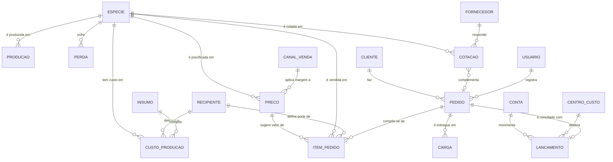
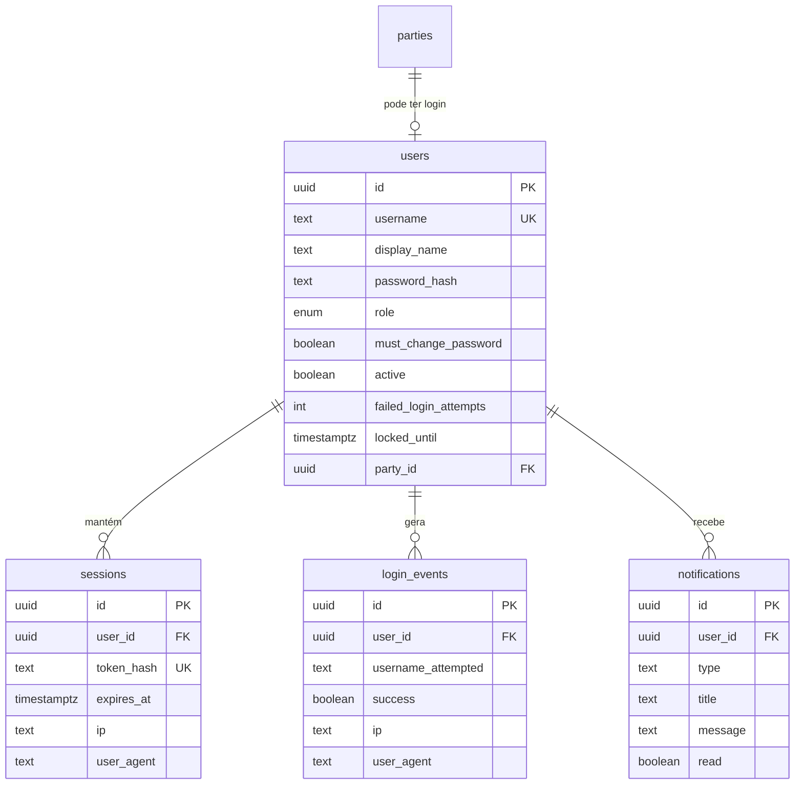
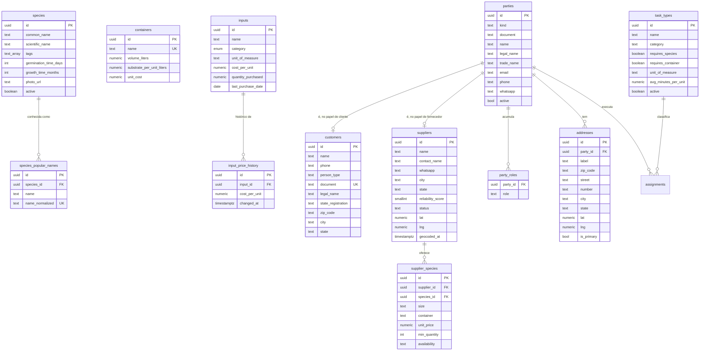
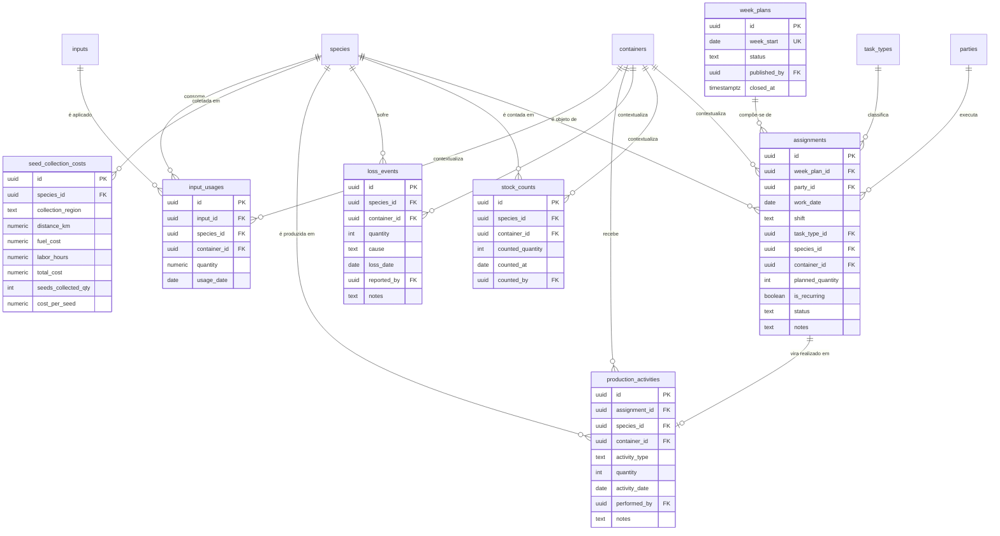
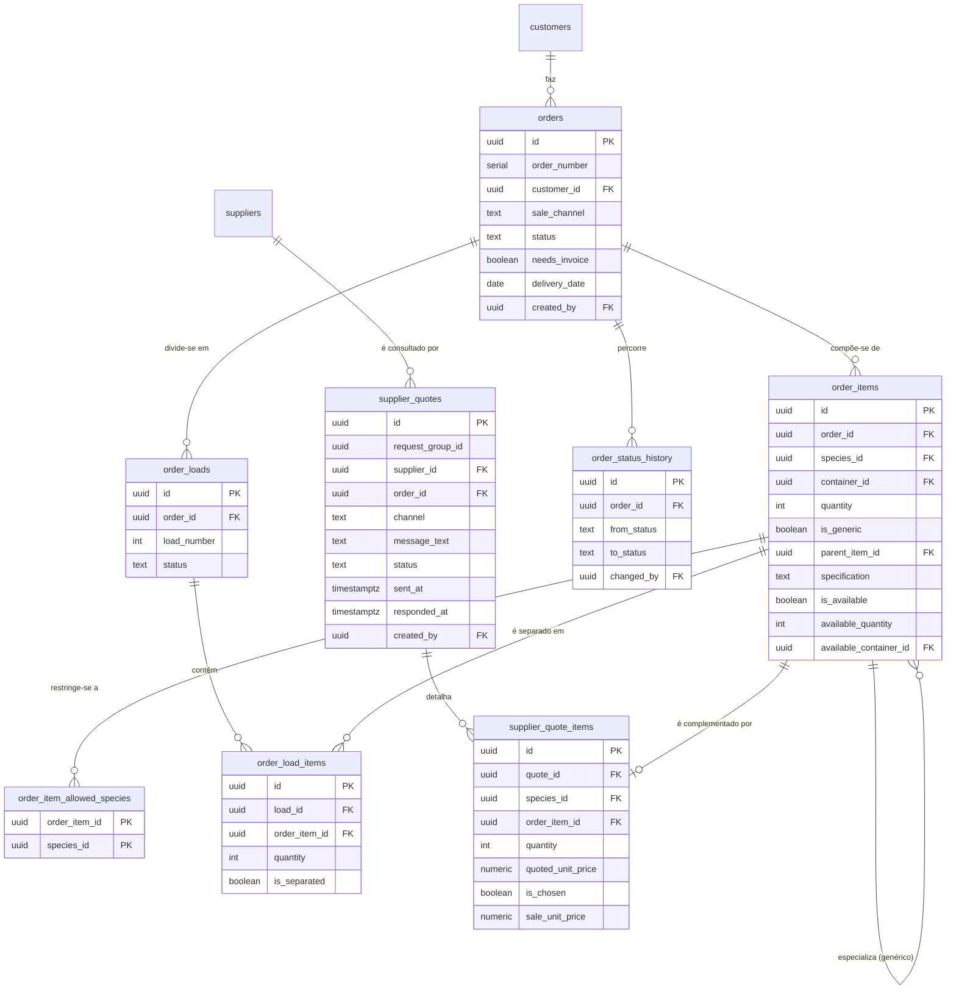
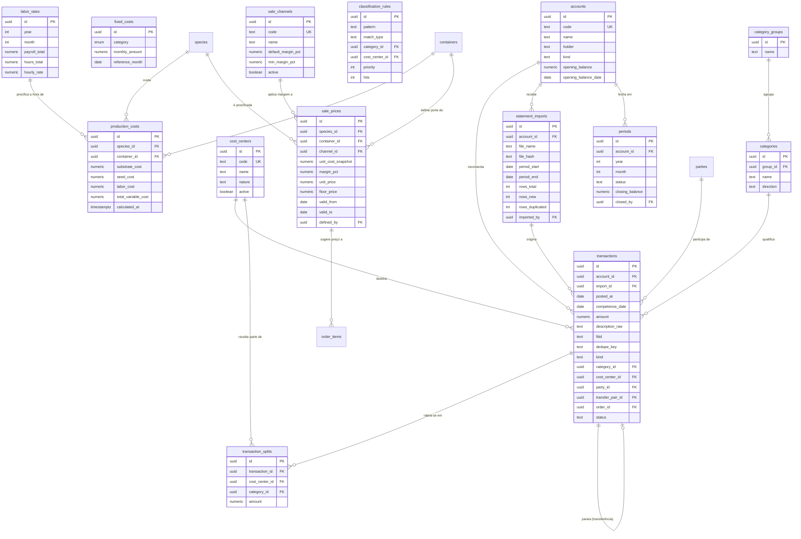

# C6: Modelo Entidade-Relacionamento

> **Artefato:** MER conceitual, lógico e físico · **Bloco:** C, Modelagem
> **Destino no TCC:** Capítulo 4, seção 4.5, Modelagem de dados
> **Fundamentação:** Elmasri e Navathe (2011) definem o modelo Entidade-Relacionamento como modelo
> conceitual de alto nível que abstrai objetos do mundo real em entidades descritas por atributos.
> A progressão conceitual → lógico → físico e os critérios de normalização seguem os mesmos autores.

---

## 1. Estratégia de modelagem

**A espécie é a entidade central.** Custo, preço, estoque, perda, item de pedido e oferta de
fornecedor referenciam-na por chave estrangeira. Essa centralidade não é preferência de projeto: é a
tradução direta da regra de negócio de que tudo no viveiro gira em torno da espécie.

O modelo é apresentado em **cinco agrupamentos**: os quatro módulos do sistema, mais o Acesso,
que atravessa todos. Um diagrama único com as 45 entidades seria ilegível em página impressa, e
usar aqui o mesmo agrupamento dos requisitos ([`B2 §2`](../B-requisitos/B2-especificacao-requisitos.md))
e da matriz de acesso ([`D4 §2`](../D-arquitetura/D4-matriz-rbac.md)) permite ler os três
documentos lado a lado sem traduzir de um para o outro.

| Agrupamento | Entidades | Papel |
|---|---|---|
| *(transversal)* **Acesso** | 4 | Autenticação, sessão, auditoria e notificação |
| **1 · Cadastros** | 12 | Catálogo de produção e identidade das pessoas: não consome nada, alimenta tudo |
| **2 · Produção** | 7 | Consumo, coleta, atividade, perda e contagem de estoque |
| **3 · Comercial** | 8 | Pedido, item, carga e cotação com fornecedor |
| **4 · Financeiro** | 14 | Extrato como fonte da verdade, custeio e preço |
| **Total** | **45** | mais 1 visão derivada (`species_unit_cost`), documentada em [`C8`](C8-dicionario-de-dados.md) |

**O preço da escolha, declarado:** agrupar por propósito faz relacionamentos cruzarem a fronteira
do diagrama: `input_usages` é da Produção e aponta para `species`, `containers` e `inputs`, que
são de Cadastros. A convenção do §3 resolve isso sem duplicar conteúdo: a entidade estrangeira
aparece como **caixa vazia**, só para a aresta existir.

Duas realocações merecem nota, porque contrariam a intuição de onde a entidade nasceu:

- **O esquema `cadastro` (`parties`, `party_roles`, `addresses`) nasceu dentro do financeiro e
  serve o módulo 1.** Foi desenhado para dar contraparte a cada linha do extrato, mas o que ele
  resolve é anterior: cliente, fornecedor e funcionário são papéis de **uma identidade só**.
- **O custeio atravessa os três primeiros módulos e desemboca no quarto.** Consome catálogo
  (Cadastros) e consumo de campo (Produção), e o resultado (custo, margem, preço) é do
  Financeiro. É a razão de o custo do viveiro depender de rotina que ninguém associa a dinheiro.

Convenções adotadas, conforme Elmasri e Navathe (2011): tabelas nomeadas no **plural**, chaves
primárias e estrangeiras declaradas explicitamente, e identificadores universais como chave
primária: o que permite gerar a chave no cliente antes da gravação, requisito do funcionamento sem
conexão (RNF-05).

---

## 2. Modelo conceitual: visão geral

Apenas entidades e relacionamentos, sem atributos. É a visão que responde "de que o sistema trata".

O diagrama conceitual apresenta **dezoito entidades**, e não as quarenta e cinco do modelo completo.
A redução é deliberada: Sommerville (2011) observa que a ausência de detalhe excessivo é
característica central do modelo, cujo objetivo é destacar o mais relevante e não especificar por
inteiro. Entidades associativas, de histórico e de auditoria aparecem apenas nos modelos lógicos por
módulo, na seção seguinte.

Quatro leituras que o modelo conceitual já entrega:

- **A espécie participa de seis relacionamentos**, e é a única entidade presente nos **quatro
  módulos**: custeio e preço no Financeiro, atividade e perda na Produção, item de pedido e
  cotação no Comercial, e o próprio catálogo em Cadastros. É a confirmação estrutural da
  centralidade declarada no §3.4 da metodologia: nenhuma outra entidade aparece em mais de dois.
- **Produção e perda são simétricas em torno da espécie.** Uma soma, a outra subtrai, e o estoque é
  a diferença: razão pela qual ele não aparece no modelo como entidade.
- **O custo e o preço estão em cadeia, não em paralelo.** O custo de produção alimenta o preço, que
  sugere o valor do item de pedido. É a tradução no modelo de dados do objetivo central do trabalho:
  substituir a precificação intuitiva por uma derivada do custo apurado.
- **O pedido conecta-se ao lançamento financeiro.** É o vínculo que permite responder "esse pedido
  foi pago?": pergunta que hoje não tem resposta sem sentar e somar.
- **A cotação liga fornecedor e pedido.** Representa a decisão de complementar com muda de terceiro
  aquilo que a produção própria não atende, sem que o pedido do cliente precise ser recusado.

---

## 3. Modelo lógico por módulo

Um diagrama por módulo, na ordem em que o fluxo do sistema os percorre, mais o Acesso à frente
por atravessar os quatro. É o mesmo agrupamento de
[`B2 §2`](../B-requisitos/B2-especificacao-requisitos.md), do
[`D1 §4`](../D-arquitetura/D1-arquitetura-c4.md) e da
[`D4 §2`](../D-arquitetura/D4-matriz-rbac.md).

**Caixa sem atributos = entidade de outro módulo.** Quando um relacionamento cruza a fronteira.
e vários cruzam, porque a espécie é referenciada em quase todo lugar: a entidade estrangeira
aparece como caixa vazia, apenas para que a aresta exista. Os atributos dela estão no diagrama do
seu próprio módulo, uma vez só.

### 3.1 Acesso: transversal aos quatro módulos

**`users.party_id` é opcional, e a opcionalidade é a regra.** Usuário é *credencial*; funcionário é
*vínculo* (`cadastro.parties`). Há pessoa com login e sem vínculo (o administrador), e pessoa com
vínculo e sem login: o diarista, que aparece na agenda e no custo sem nunca abrir o aplicativo
(RN-54). Fundir as duas numa tabela só obrigaria a inventar um dos dois lados.

O usuário não pertence a módulo de negócio: ele opera os quatro. `notifications` está aqui, e não
no Comercial que a origina, porque a notificação é do **destinatário**: quem a lê é uma pessoa,
não um pedido.

### 3.2 Módulo 1 · Cadastros

O que é estável e se repete. Não consome nada e alimenta os outros três, é o único módulo cujo
diagrama não tem caixa vazia, porque não referencia entidade de fora.

**Por que `species_popular_names` é entidade separada.** O nome popular é atributo **multivalorado**
a mesma espécie tem vários nomes regionais, e a busca precisa encontrá-la por qualquer um (RF-09).
Elmasri e Navathe tratam esse caso explicitamente: atributo multivalorado não cabe em coluna única, e
repetir a espécie por nome violaria a primeira forma normal. A restrição de unicidade sobre o nome
normalizado garante o outro lado da regra: **um nome popular aponta para uma única espécie**.

**Por que `input_price_history` existe.** Sem ela, atualizar o preço de um insumo reescreveria o
custo de todas as espécies retroativamente: o custo apurado em março passaria a refletir o preço de
agosto. É a anomalia de atualização que a normalização busca evitar, e a solução é preservar o
histórico em vez de sobrescrever (RF-11).

**`task_types` é cadastro, e não configuração de tela.** Ele traz o `avg_minutes_per_unit`, o
tempo médio por unidade, que é o que liga uma tarefa de campo a um custo. Passa na regra de corte
do módulo: apagar um tipo de tarefa deixaria sem sentido toda atribuição passada que o usou.

**Por que `parties` está aqui, e não no Financeiro onde nasceu.** As três entidades do esquema
`cadastro` (`parties`, `party_roles`, `addresses`) foram desenhadas para dar contraparte a cada
linha do extrato bancário. Mas o que elas resolvem é anterior ao dinheiro: **cliente, fornecedor e
funcionário são papéis da mesma pessoa**, e quem vende muda e às vezes compra tem de ser um
cadastro só. `customers` e `suppliers` sobrevivem como as tabelas **do papel**, é nelas que ficam
os campos que não são de identidade: dados fiscais de um lado, espécies ofertadas e geocodificação
do outro. O papel `funcionario` existe em `party_roles` sem tabela própria, porque um funcionário
não tem atributo que um `party` já não tenha.

**`container` do fornecedor é texto livre**, e não chave estrangeira para `containers`. A distinção é
deliberada e vale registrá-la: a tabela de recipientes modela a **produção interna**, com volume e
consumo de substrato usados no custeio. O fornecedor externo usa embalagem arbitrária, raiz nua,
lata, saco de um metro: que não tem custo de substrato a apurar. Forçá-lo na lista interna
corromperia a base do custeio para representar um dado que não a alimenta.

**`status` do fornecedor contempla "não contatar"**, que é registro de **oposição do titular** ao
tratamento de seus dados para contato comercial, e não um estado operacional. Ver
[`E5`](../E-qualidade/E5-mapeamento-lgpd.md).

### 3.3 Módulo 2 · Produção

Registro do que acontece no campo. Consome o catálogo do módulo 1 (daí as três caixas vazias) e
entrega estoque para o Comercial e medida de consumo para o custeio.

**A agenda é a única fonte possível de horas.** `assignments` é a célula da grade, pessoa, dia,
turno, tipo de tarefa: e `week_plans` é a semana que as reúne, com situação própria: rascunho,
publicada, fechada. Um turno vale **quatro horas** por convenção (RN-48), e é essa conversão que
transforma uma grade de planejamento em custo de mão de obra sem exigir controle de ponto.

**`production_activities.assignment_id` é opcional, de propósito.** A atividade realizada pode
nascer de uma tarefa planejada (o caso normal) ou avulsa, quando alguém faz algo que não estava
na agenda. Tornar o vínculo obrigatório proibiria o segundo caso, que é justamente o que a agenda
não consegue prever.

**`input_usages` é o único registro de campo que já existe.** Ela liga insumo, espécie e
recipiente à quantidade gasta, e é a dependência-raiz do custeio: sem ela, o custo por muda não
tem parcela de insumo. Está no módulo do colaborador, não no do dinheiro, porque quem a preenche
é quem está com as mãos na terra.

**O estoque não é entidade.** É quantidade **derivada**: produção registrada, menos perdas, menos o
que saiu em pedidos aprovados. Modelá-lo como entidade criaria duas verdades sobre o mesmo número.
a calculada e a armazenada: que divergiriam ao primeiro registro esquecido. A decisão está declarada
desde o [glossário](../A-fundacao/A2-glossario-dominio.md), na lista de termos deliberadamente não
adotados.

**`stock_counts` não contradiz isso.** Não armazena o estoque: armazena o **evento de contagem
física**, com data e responsável. Quando a contagem diverge do calculado, prevalece a contagem, e a
divergência fica registrada, porque ela própria é informação: indica registro de produção ou de perda
que não foi feito.

**A causa da perda é lista fechada**: seca, praga, geada, manuseio, outro. Não é campo de texto por
decisão explícita: causa digitada à mão inviabiliza a análise por causa, que é justamente o que o
indicador de mortalidade precisa produzir.

**`quantity` em `loss_events` é a unidade de mortalidade.** A taxa é a razão entre a soma das perdas e
a soma da produção do período, por espécie, e é dela que decorre o alerta acima de 20%, que é regra
de negócio e não configuração de painel.

### 3.4 Módulo 3 · Comercial

O ciclo do pedido e a cotação que o complementa. `customers` e `suppliers` aparecem vazios: são
cadastro, e o Comercial só os referencia.

**O item genérico é o ponto mais sutil do modelo.** Um item de pedido pode não ter espécie:
`is_generic` verdadeiro e `species_id` nulo representam "500 mudas nativas", sem escolha das
espécies. Três consequências estruturais:

1. **`species_id` é opcional**, ao contrário do que a centralidade da espécie sugeriria. A restrição
   de integridade garante a coerência: item genérico **não pode** ter espécie, e item específico
   **precisa** ter: salvo quando é filho de um genérico.
2. **`parent_item_id` é auto-relacionamento.** Ao decidir com que espécies atender o item genérico, o
   sistema cria itens filhos que o especializam, preservando o item original tal como o cliente o
   pediu.
3. **`order_item_allowed_species` é tabela associativa** que materializa a lista fechada de espécies
   aceitas (RF-67). Ausência de linhas significa **aberto**, qualquer espécie atende.

**Por que a carga é entidade e não atributo do pedido.** Um pedido grande sai em mais de uma viagem,
e cada viagem tem estado próprio de separação. Modelar como atributo obrigaria a repetir o pedido por
viagem, ou a perder o controle da separação parcial.

**A disponibilidade parcial ocupa três colunas**, `is_available`, `available_quantity` e
`available_container_id`: porque são quatro estados distintos, não dois: disponível, parcial,
indisponível e ainda não verificado. Um único campo booleano confundiria "não tem" com "ninguém
olhou ainda", que são operacionalmente opostos.

**`request_group_id` sem tabela-mãe.** Um disparo de cotação para cinco fornecedores gera cinco
registros que compartilham o mesmo identificador de grupo. Não há entidade "consulta" porque ela não
teria atributo próprio algum: seria uma tabela de uma coluna. O agrupamento é feito na leitura.

### 3.5 Módulo 4 · Financeiro

O módulo restrito, e o único modelado em **esquema próprio** (`financeiro`). A separação é de
segurança, não de organização: a base mistura gasto do viveiro com gasto pessoal da família e da
clínica, e a fronteira de esquema torna a restrição de acesso estrutural em vez de apenas
procedimental.

Custo e preço estão aqui, e não na Produção que os alimenta, pela mesma razão que a compra está:
são dinheiro. O que a Produção entrega é medida de campo (quanto se consumiu, quantas horas), e
o que sai daqui é custo por muda e preço por canal.

#### O extrato como fonte da verdade

Quatro decisões de modelagem com justificativa:

- **Nenhum lançamento sem conta.** Não há lançamento órfão: o gasto em dinheiro entra por uma conta
  chamada *caixa*, que também é conta. É essa obrigatoriedade que faz o saldo calculado ter de bater
  com o saldo do banco.
- **Duas datas, não uma.** `posted_at` é quando o banco moveu e nunca é editado; `competence_date` é
  o mês a que o gasto pertence economicamente. Saldo apura-se pela primeira, custo pela segunda.
  Registrar apenas uma tornaria irreversível a perda: reconstruir a competência anos depois é
  impossível.
- **`description_raw` nunca é editado.** É a prova de que a linha veio do banco e não da memória de
  alguém: a diferença exata entre este modelo e a planilha que ele substitui.
- **O rateio é entidade separada.** O caso comum usa o centro de custo direto no lançamento; o rateio
  existe para o caso real da energia de um imóvel que serve a dois fins. A invariante: a soma das
  partes iguala o total: é validada na camada de aplicação, onde a mensagem de erro é legível e o
  comportamento é testável.
- **Duas datas, não uma.** `posted_at` é quando o banco moveu e nunca é editado; `competence_date` é
  o mês a que o gasto pertence economicamente. Saldo apura-se pela primeira, custo pela segunda.
  Registrar apenas uma tornaria irreversível a perda: reconstruir a competência anos depois é
  impossível.
- **`description_raw` nunca é editado.** É a prova de que a linha veio do banco e não da memória de
  alguém: a diferença exata entre este modelo e a planilha que ele substitui.
- **O rateio é entidade separada.** O caso comum usa o centro de custo direto no lançamento; o rateio
  existe para o caso real da energia de um imóvel que serve a dois fins. A invariante: a soma das
  partes iguala o total: é validada na camada de aplicação, onde a mensagem de erro é legível e o
  comportamento é testável.
- **`description_raw` nunca é editado.** É a prova de que a linha veio do banco e não da memória de
  alguém: a diferença exata entre este modelo e a planilha que ele substitui.
- **O rateio é entidade separada.** O caso comum usa o centro de custo direto no lançamento; o rateio
  existe para o caso real da energia de um imóvel que serve a dois fins. A invariante: a soma das
  partes iguala o total: é validada na camada de aplicação, onde a mensagem de erro é legível e o
  comportamento é testável.
- **O rateio é entidade separada.** O caso comum usa o centro de custo direto no lançamento; o rateio
  existe para o caso real da energia de um imóvel que serve a dois fins. A invariante: a soma das
  partes iguala o total: é validada na camada de aplicação, onde a mensagem de erro é legível e o
  comportamento é testável.

**`labor_rates` guarda o valor-hora do período, e não o salário de ninguém.** É a folha do mês
dividida pelas horas do mês (RN-53): um número por período, que multiplica as horas da agenda para
produzir o custo de mão de obra por espécie. A escolha é deliberada: o custo fica real, e o
sistema nunca precisa saber quanto cada pessoa ganha.

#### Do custo ao preço

A precificação é a ponte entre o custeio e o comercial: consome o custo unitário apurado e entrega
o preço praticado no pedido.

**Por que o canal é entidade e não texto.** A margem é atributo do canal, não do preço: alterar a
margem do atacado deve refletir-se em todos os preços daquele canal, e um canal escrito como texto
em cada linha tornaria essa alteração uma varredura sujeita a erro. É a mesma anomalia de atualização
que motiva a separação em qualquer normalização.

**Por que o preço tem vigência.** `valid_from` e `valid_to` delimitam o período em que o preço vale.
Sobrescrever o preço destruiria a informação de quanto se vendeu a quanto, e o relatório de margem
passaria a comparar a venda de março com o custo de agosto. É a razão que motiva
`input_price_history`, aplicada ao outro lado da equação.

**Por que o custo é fotografado no preço.** `unit_cost_snapshot` guarda o custo unitário vigente no
momento em que o preço foi definido. Sem ele, a margem registrada e a margem recalculada divergiriam
a cada alteração de custo, e não seria possível responder "qual era a margem quando eu vendi".

**Por que o piso é coluna e não constante.** O piso mínimo varia por canal e por espécie: uma espécie
de ciclo longo tem piso diferente de uma pioneira. Fixá-lo em configuração única obrigaria a escolher
entre um piso alto demais para umas e baixo demais para outras.

**`total_variable_cost` e `cost_per_seed` são atributos derivados**, calculados a partir dos demais
e mantidos pelo próprio banco: o primeiro em `production_costs`, aqui; o segundo em
`seed_collection_costs`, na Produção. Armazená-los é desnormalização deliberada: evita recalcular a
soma a cada leitura de relatório, sem risco de divergência, porque o banco não permite gravá-los
diretamente.

**O preço sugere, não impõe.** O item de pedido registra o valor **efetivamente acordado**, que
pode diferir do sugerido dentro do limite do piso. A entidade de preço é fonte de sugestão e de
validação: a negociação existe, e o modelo precisa acomodá-la sem perder o controle da margem.

---

## 4. Nota de normalização

O esquema está em **terceira forma normal**, com duas desnormalizações deliberadas e declaradas:
os atributos derivados de custo (§3.2) e a redundância entre `active` e `status` em fornecedores, que
distinguem arquivamento de registro (soft-delete) de estado comercial, informações diferentes que um
único campo não expressaria.

A demonstração formal da progressão 1FN → 2FN → 3FN, com as anomalias de inserção, exclusão e
atualização evitadas em cada passo, **não integra o conjunto de artefatos selecionados**
(corresponderia ao item C7 do catálogo). O que se registra aqui são as decisões, não a derivação.

---

## 5. Observação sobre a origem deste artefato

As duas entidades de precificação (`sale_channels` e `sale_prices`, hoje no §3.5) não constavam
da primeira versão deste modelo. Foram
acrescentadas ao se verificar que os requisitos **RF-31 a RF-35**, margem por canal, preço sugerido,
piso mínimo e relatório de margem: não tinham onde persistir: o único preço de venda modelado era o
de revenda de muda de terceiro, que atende ao fornecedor e não à produção própria.

O registro fica aqui porque ilustra a função da matriz de rastreabilidade
([`B5`](../B-requisitos/B5-matriz-rastreabilidade.md)): cinco requisitos sem entidade correspondente
são um defeito de especificação que só aparece quando requisito e modelo são confrontados
sistematicamente.
