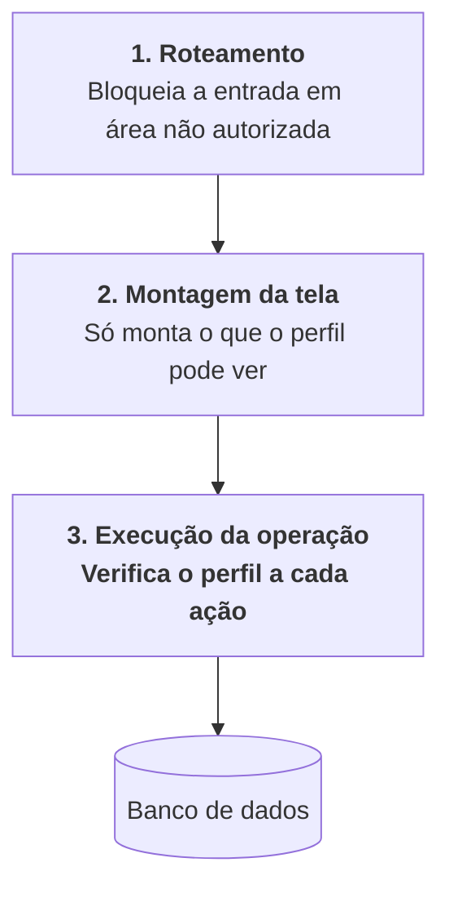

# D4 — Matriz de controle de acesso baseado em papéis

> **Artefato:** Matriz RBAC · **Bloco:** D — Arquitetura
> **Destino no TCC:** Capítulo 4, seção 4.6 — Segurança e controle de acesso
> **Fundamentação:** Sommerville (2011) trata autenticação e controle de acesso como controles de
> **prevenção de vulnerabilidade**, e observa que a proteção tem como contrapartida a perda de
> produtividade do usuário, cabendo ao projetista encontrar o equilíbrio em cada cenário. Este
> documento registra onde esse equilíbrio foi fixado.

---

## 1. Os papéis

Três perfis de negócio, correspondentes às funções reais da empresa, mais um papel técnico.

| Papel | Corresponde a | Pessoas | Natureza |
|---|---|---|---|
| **Chefia** | Direção — vendas, finanças, decisões, entregas | 1 | Negócio |
| **Gerência** | Coordenação — operação, estoque, produção, tarefas | 2 | Negócio |
| **Colaborador** | Execução em campo | 6 | Negócio |
| **Administrador** | Manutenção do sistema e gestão de usuários | 1, acumulado | **Técnico** |

**O administrador não é uma função da empresa.** Não participa de nenhuma rotina de negócio: seu
escopo limita-se a criar usuários, atribuir perfis e manter o sistema. É representado à parte para
que a matriz de negócio reflita a operação real do viveiro, e não a estrutura interna do sistema.

**Princípio adotado:** o menor privilégio que permita à pessoa fazer o seu trabalho. Onde houve
dúvida, a decisão pendeu para conceder — um perfil restrito demais produz pedido de exceção
constante, e a exceção concedida caso a caso é pior que a permissão declarada.

---

## 2. Matriz por recurso e operação

Legenda: **C** criar · **L** ler · **A** atualizar · **E** excluir · **—** sem acesso

| Recurso | Chefia | Gerência | Colaborador | Administrador |
|---|:--:|:--:|:--:|:--:|
| **Espécies** | C L A E | L | L | C L A E |
| **Recipientes** | C L A E | L | L | C L A E |
| **Insumos** | C L A E | L | L | C L A E |
| **Consumo de insumo** | L | L | **C L** | L |
| **Custos fixos** | C L A E | — | — | C L A E |
| **Coleta de sementes** | C L A E | L | — | C L A E |
| **Custo unitário** | L | L | **—** | L |
| **Atividades de produção** | L | C L A | **C L** | L |
| **Estoque** | L | C L A | L | L |
| **Perdas** | L | L A | **C L** | L |
| **Análise de perdas** | L | L | — | L |
| **Margem por canal** | C L A | L | **—** | L |
| **Preço de venda** | C L A | L | **—** | L |
| **Clientes** | C L A E | L | — | C L A E |
| **Dados fiscais de cliente** | C L A | L | — | C L A |
| **Pedidos** | C L A E | L A | L | C L A E |
| **Aprovação de pedido** | **A** | — | — | A |
| **Verificação de disponibilidade** | L | **C L A** | — | L |
| **Cargas** | L | C L A | L | L |
| **Separação de carga** | L | L A | **A** | L |
| **Entregas** | C L A | L | — | C L A |
| **Fornecedores** | C L A E | — | — | C L A E |
| **Cotações** | C L A | — | — | C L A |
| **Escolha de proposta** | **A** | — | — | A |
| **Financeiro — todos os recursos** | **C L A E** | **—** | **—** | C L A E |
| **Indicadores** | L | L (parcial) | — | L |
| **Usuários e perfis** | — | — | — | **C L A E** |
| **Sessões próprias** | L E | L E | L E | L E |
| **Auditoria de acesso** | — | — | — | L |

---

## 3. As oito regras de exceção

A matriz não se explica sozinha. Oito decisões merecem justificativa, porque em cada uma a permissão
restringe alguém que aparentemente deveria ter acesso.

### 3.1 O colaborador não vê custo nem preço

É a restrição mais ampla da matriz. O colaborador registra consumo de insumo — dado que **compõe** o
custo — e não pode consultar o custo resultante.

A razão não é desconfiança, é escopo: o colaborador não toma decisão de preço, e a informação de
margem não o ajuda em nenhuma de suas cinco tarefas. Expô-la aumentaria a superfície de dado sensível
em seis dispositivos que circulam em campo, sem contrapartida operacional.

### 3.2 O financeiro é exclusivo da chefia

Restrição total, e não parcial: a gerência não acessa nenhuma tela financeira, nem em modo de
leitura.

A base mistura gasto do viveiro com gasto pessoal da família e da clínica. Separá-los por centro de
custo é justamente o objetivo do subsistema — mas, até que a separação exista e mesmo depois, o
acesso permanece restrito, porque a natureza pessoal do dado não desaparece com a classificação. É a
única restrição da matriz cuja motivação é de privacidade e não de escopo funcional.

### 3.3 Aprovar pedido é privativo da chefia

A gerência pode ler o pedido, editar quantidades e verificar disponibilidade, mas não aprová-lo. A
aprovação é o ato que fixa o preço, e preço é decisão de quem responde pela margem.

### 3.4 A gerência não registra custo fixo

Custo fixo é folha, energia, água e depreciação — dado financeiro, ainda que consumido pelo custeio.
Fica com a chefia pela mesma razão de 3.2.

### 3.5 O colaborador atualiza a separação, mas não a cria

A carga é gerada pelo sistema no fechamento do pedido. O colaborador **marca** itens como separados,
sem poder criar ou remover carga. A distinção evita que um erro de operação em campo altere o que foi
comercialmente acordado.

### 3.6 Verificar disponibilidade é privativo da gerência

Nem a chefia executa a verificação. É quem está no viveiro que sabe o que existe, e a verificação
feita à distância seria adivinhação registrada como fato — exatamente o problema que o sistema
existe para eliminar.

### 3.7 Ninguém administra os próprios usuários

Nenhum perfil de negócio cria usuário ou altera perfil, inclusive a chefia. A separação entre
autoridade de negócio e autoridade de sistema impede que a escalada de privilégio seja um caminho de
uso normal.

### 3.8 Os cadastros pertencem à chefia, não à gerência

Catálogo de espécies, recipientes, insumos, clientes e fornecedores são criados e alterados pela
chefia. À gerência resta a leitura.

A razão é que todos esses cadastros **alimentam o custeio ou o comercial**, e não a operação diária:
o preço de um insumo altera o custo de todas as espécies que o utilizam; um cliente cadastrado com
documento errado impede a emissão da nota. São dados de baixa frequência de alteração e alto custo de
erro, e quem responde pela consequência é quem os mantém.

A gerência lê tudo o que precisa para operar — para verificar disponibilidade é necessário conhecer
espécies e recipientes, e para acompanhar um pedido é necessário saber de quem ele é.

---

## 3.9 Nota sobre o alcance atual do perfil colaborador

A matriz especifica as permissões do colaborador em sua forma completa, mas o **uso do sistema em
campo pelos colaboradores está previsto para iteração posterior**. Na primeira etapa de implantação,
os usuários efetivos são a chefia e a gerência — três pessoas.

A decisão tem consequência direta sobre a avaliação de usabilidade: os sujeitos do instrumento
descrito em [`F3`](../F-ux/F3-plano-avaliacao-usabilidade.md) são chefia e gerência. A condição do
§3.6 da metodologia — usuários reconhecidamente sem formação técnica — permanece atendida, já que
nenhum dos três a possui.

Os requisitos e casos de uso do colaborador permanecem especificados, e não removidos: são projeto,
e o projeto antecede a implantação.

---

## 4. Onde a verificação ocorre

Três níveis, complementares e não substituíveis entre si.

**O terceiro nível é o que de fato protege.** Os dois primeiros são conveniência de interface:
impedem que o usuário chegue a uma tela inútil e evitam apresentar botões que não funcionariam.
Podem ser contornados por quem acione a operação diretamente.

A verificação na execução da operação é a que não se contorna, e é por isso que o requisito RF-06
determina que a permissão seja verificada **a cada operação, e não apenas ocultando elementos da
interface**. Ocultar um botão não é controle de acesso — é o inverso: dá a impressão de proteção
onde não há.

---

## 5. O compromisso entre proteção e produtividade

Sommerville (2011) observa que um sistema que exige múltiplas senhas frequentemente deixa o usuário
sem acesso, por não conseguir memorizá-las, e ilustra com isso que a proteção adicional cobra seu
preço em produtividade. Três decisões deste sistema explicitam onde o preço foi pago e onde não foi.

| Decisão | Proteção | Produtividade | Escolha |
|---|---|---|---|
| **Duração da sessão no dispositivo do colaborador** | Sessão longa amplia a janela de uso indevido de um aparelho perdido | Sessão curta exigiria autenticação a cada registro de perda, em campo, com as mãos sujas | **Sessão longa**, compensada pela possibilidade de encerrar sessões à distância (RF-07) e pelo registro de acesso (RF-04) |
| **Troca de senha no primeiro acesso** | Impede que a senha temporária, comunicada verbalmente, permaneça em uso | Acrescenta uma etapa ao primeiro acesso de cada usuário | **Exigida.** Custo pago uma única vez por pessoa |
| **Troca periódica obrigatória de senha** | Reduz a janela de uma credencial vazada | Senha trocada com frequência é senha anotada em papel — o próprio Sommerville usa este caso como exemplo de falha originada em decisão de projeto | **Não adotada** |

A capacidade de encerrar sessões à distância é o que torna a sessão longa defensável: o risco que ela
cria — aparelho perdido com sessão ativa — tem tratamento direto e ao alcance do usuário, sem
depender de administrador.

---

## 6. Rastreabilidade

| Requisito | Onde a matriz o realiza |
|---|---|
| RF-05 | Linha *Usuários e perfis*, exclusiva do administrador |
| RF-06 | Seção 4 — verificação na execução da operação |
| RF-07 | Linha *Sessões próprias*, com leitura e exclusão para todos os perfis |
| RF-44 | Linha *Aprovação de pedido*, exclusiva da chefia (regra 3.3) |
| RF-62 | Linha *Financeiro*, exclusiva da chefia (regra 3.2) |
| RNF-12 | Seção 4 — verificação no servidor, nunca no navegador |

A matriz é insumo direto da modelagem de ameaças
([`E4`](../E-qualidade/E4-modelagem-de-ameacas.md)): cada permissão concedida é uma superfície a
avaliar, e cada restrição é um controle já aplicado.
