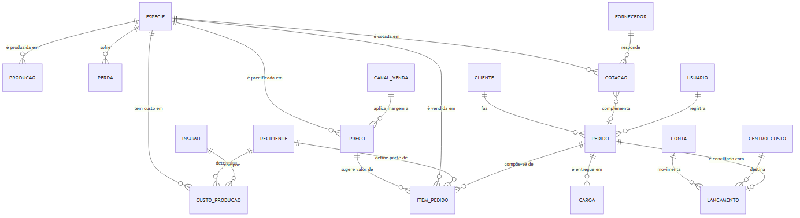
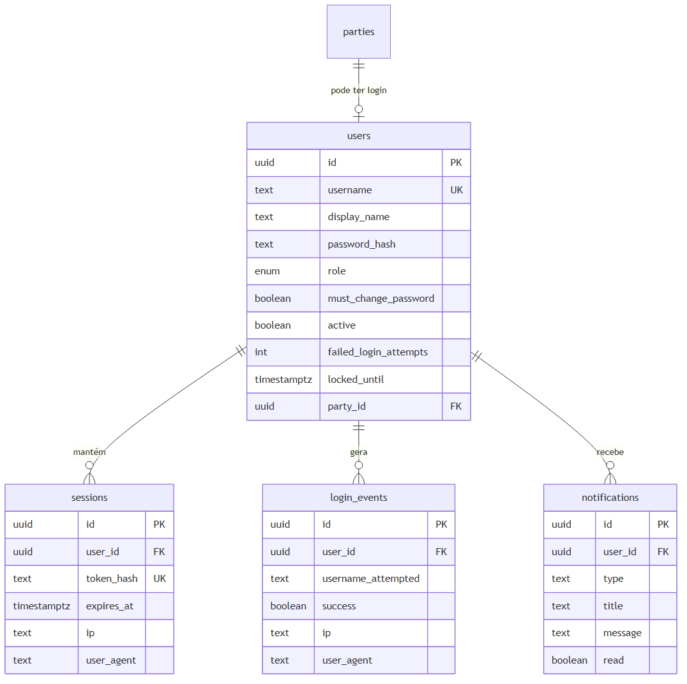
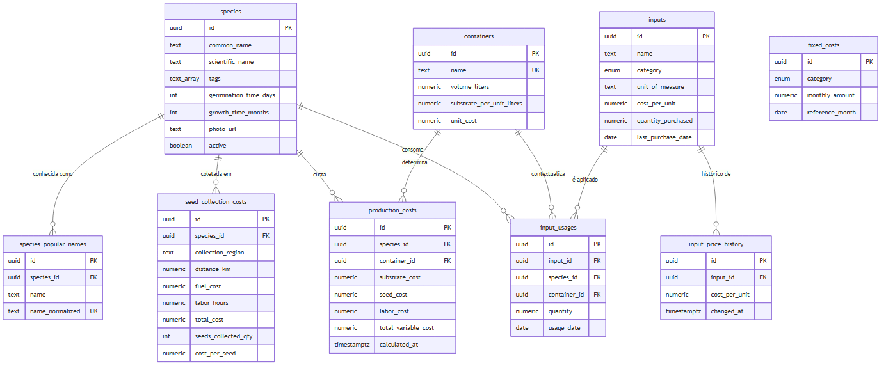
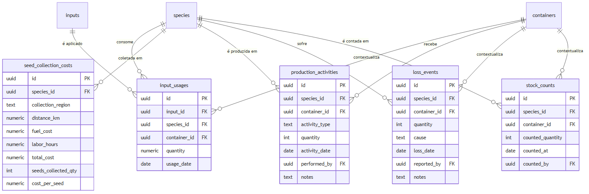
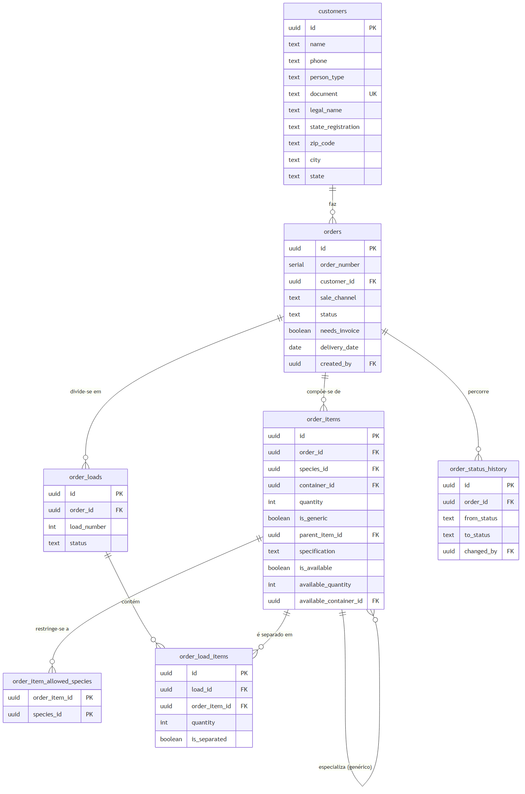
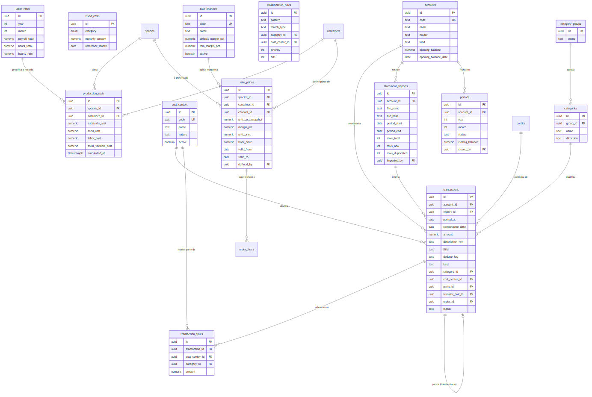
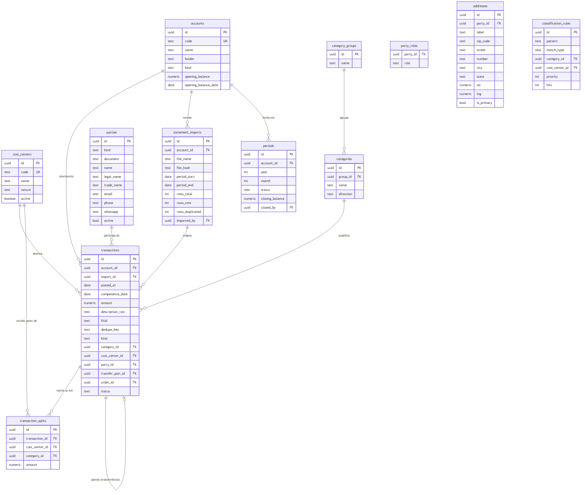
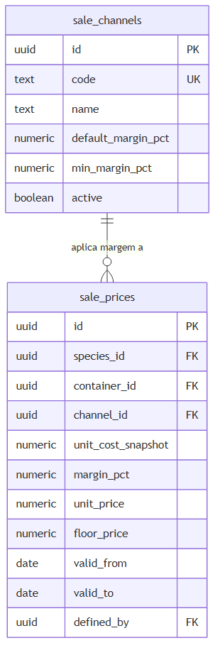
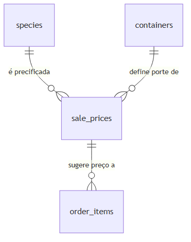

# 4.4 Modelagem de dados

> Gerado a partir de `C-modelagem/C6-modelo-entidade-relacionamento.md`.
> **Não edite este arquivo** — edite o artefato de origem e rode `npm run docs:tcc`.

---

## 1. Estratégia de modelagem

**A espécie é a entidade central.** Custo, preço, estoque, perda, item de pedido e oferta de
fornecedor referenciam-na por chave estrangeira. Essa centralidade não é preferência de projeto: é a
tradução direta da regra de negócio de que tudo no viveiro gira em torno da espécie.

O modelo é apresentado em **sete áreas**. Um diagrama único com as 39 entidades seria ilegível em
página impressa.

| Área | Entidades | Papel |
|---|---|---|
| **Acesso** | 4 | Autenticação, sessão, auditoria e notificação |
| **Catálogo e custeio** | 9 | Catálogo e apuração de custo — fundação de todo o resto |
| **Produção** | 3 | Produção, perdas e contagem de estoque |
| **Comercial** | 7 | Cliente, pedido, item, carga |
| **Precificação** | 2 | Canal de venda e preço vigente |
| **Fornecedores** | 4 | Cadastro do fornecedor e cotação |
| **Financeiro** | 10 | Extrato como fonte da verdade |
| **Total** | **39** | |

### Área de dados não é módulo

O sistema é organizado em **quatro módulos** — Cadastros, Produção, Comercial, Financeiro
([`00-mapa-de-rotinas`](../../rotinas/00-mapa-de-rotinas.md)) —, e as áreas acima **não são**
esses módulos. A divergência é deliberada, e vale explicá-la porque é o tipo de coisa que a
banca pergunta.

O módulo agrupa por **propósito**: onde a tela mora e quem pode abri-la. A área de dados
agrupa por **vizinhança de chave estrangeira**: o que precisa ser lido no mesmo diagrama para
o diagrama fazer sentido. `input_usages` é do módulo Produção (é o colaborador quem a
preenche, no celular), mas aponta para `species`, `containers` e `inputs`, que são do módulo
Cadastros — desenhá-la longe deles produziria uma figura com três setas para fora e nenhuma
informação dentro.

O mapa entre as duas decomposições:

| Módulo | Onde suas entidades estão |
|---|---|
| *(transversal)* **Acesso** | área **Acesso**, integralmente |
| **1 · Cadastros** | `species`, `species_popular_names`, `containers`, `inputs`, `input_price_history` (área Catálogo e custeio); `customers` (área Comercial); `suppliers`, `supplier_species` (área Fornecedores); `parties`, `party_roles`, `addresses` (área Financeiro — esquema `cadastro`) |
| **2 · Produção** | área **Produção**, integralmente; mais `input_usages` e `seed_collection_costs` (área Catálogo e custeio) |
| **3 · Comercial** | resto da área **Comercial** (`orders`, `order_items`, `order_loads`, …); `supplier_quotes`, `supplier_quote_items` (área Fornecedores) |
| **4 · Financeiro** | resto da área **Financeiro**; `fixed_costs`, `production_costs`, `species_unit_cost` (área Catálogo e custeio); área **Precificação**, integralmente |

Duas leituras que esse mapa torna imediatas:

- **O esquema `cadastro` (`parties`, `party_roles`, `addresses`) nasceu dentro do financeiro e
  serve o módulo 1.** Foi desenhado para dar contraparte a cada linha do extrato, mas o que ele
  resolve é anterior: cliente, fornecedor e funcionário são papéis de **uma identidade só**.
- **O custeio atravessa os três primeiros módulos e desemboca no quarto.** Consome catálogo
  (Cadastros) e consumo de campo (Produção), e o resultado — custo, margem, preço — é do
  Financeiro. É a razão de o custo do viveiro depender de rotina que ninguém associa a dinheiro.

Convenções adotadas, conforme Elmasri e Navathe (2011): tabelas nomeadas no **plural**, chaves
primárias e estrangeiras declaradas explicitamente, e identificadores universais como chave
primária — o que permite gerar a chave no cliente antes da gravação, requisito do funcionamento sem
conexão (RNF-05).

---

## 2. Modelo conceitual — visão geral

Apenas entidades e relacionamentos, sem atributos. É a visão que responde "de que o sistema trata".

**Figura 6** — Modelo conceitual — visão geral. Fonte: elaborado pelo autor (2026).

O diagrama conceitual apresenta **dezoito entidades**, e não as trinta e nove do modelo completo.
A redução é deliberada: Sommerville (2011) observa que a ausência de detalhe excessivo é
característica central do modelo, cujo objetivo é destacar o mais relevante e não especificar por
inteiro. Entidades associativas, de histórico e de auditoria aparecem apenas nos modelos lógicos por
área, na seção seguinte.

Quatro leituras que o modelo conceitual já entrega:

- **A espécie participa de seis relacionamentos**, em cinco áreas distintas — custeio, produção,
  precificação, comercial e fornecedores. É a confirmação estrutural da centralidade declarada no
  §3.4 da metodologia: nenhuma outra entidade aparece em mais de duas áreas.
- **Produção e perda são simétricas em torno da espécie.** Uma soma, a outra subtrai, e o estoque é
  a diferença — razão pela qual ele não aparece no modelo como entidade.
- **O custo e o preço estão em cadeia, não em paralelo.** O custo de produção alimenta o preço, que
  sugere o valor do item de pedido. É a tradução no modelo de dados do objetivo central do trabalho:
  substituir a precificação intuitiva por uma derivada do custo apurado.
- **O pedido conecta-se ao lançamento financeiro.** É o vínculo que permite responder "esse pedido
  foi pago?" — pergunta que hoje não tem resposta sem sentar e somar.
- **A cotação liga fornecedor e pedido.** Representa a decisão de complementar com muda de terceiro
  aquilo que a produção própria não atende, sem que o pedido do cliente precise ser recusado.

---

## 3. Modelo lógico por área

### 3.1 Acesso *(transversal)*

**Figura 7** — Acesso (transversal). Fonte: elaborado pelo autor (2026).

Três decisões de modelagem que respondem a requisitos não funcionais de segurança:

- **A senha nunca é armazenada** — apenas seu resumo criptográfico (`password_hash`, RNF-09). O
  mesmo vale para o identificador de sessão (`token_hash`, RNF-10).
- **`login_events` registra a tentativa, não apenas o sucesso** — daí `username_attempted` ser texto
  e não chave estrangeira: uma tentativa contra usuário inexistente também precisa ser registrada
  (RF-04), e é justamente ela que evidencia ataque.
- **`ip` e `user_agent` na sessão** existem para que o usuário identifique o aparelho na lista de
  sessões ativas e encerre um celular perdido (RF-07).

### 3.2 Catálogo e custeio — módulos 1, 2 e 4

**Figura 8** — Catálogo e custeio — módulos 1, 2 e 4. Fonte: elaborado pelo autor (2026).

**Por que `species_popular_names` é entidade separada.** O nome popular é atributo **multivalorado**
— a mesma espécie tem vários nomes regionais, e a busca precisa encontrá-la por qualquer um (RF-09).
Elmasri e Navathe tratam esse caso explicitamente: atributo multivalorado não cabe em coluna única, e
repetir a espécie por nome violaria a primeira forma normal. A restrição de unicidade sobre o nome
normalizado garante o outro lado da regra: **um nome popular aponta para uma única espécie**.

**Por que `input_price_history` existe.** Sem ela, atualizar o preço de um insumo reescreveria o
custo de todas as espécies retroativamente — o custo apurado em março passaria a refletir o preço de
agosto. É a anomalia de atualização que a normalização busca evitar, e a solução é preservar o
histórico em vez de sobrescrever (RF-11).

**`total_variable_cost` e `cost_per_seed` são atributos derivados**, calculados a partir dos demais e
mantidos pelo próprio banco. Armazená-los é desnormalização deliberada: evita recalcular a soma a
cada leitura de relatório, sem risco de divergência, porque o banco não permite gravá-los
diretamente.

### 3.3 Produção — atividade, perdas e estoque *(módulo 2)*

**Figura 9** — Produção — atividade, perdas e estoque (módulo 2). Fonte: elaborado pelo autor (2026).

**O estoque não é entidade.** É quantidade **derivada**: produção registrada, menos perdas, menos o
que saiu em pedidos aprovados. Modelá-lo como entidade criaria duas verdades sobre o mesmo número —
a calculada e a armazenada — que divergiriam ao primeiro registro esquecido. A decisão está declarada
desde o [glossário](../A-fundacao/A2-glossario-dominio.md), na lista de termos deliberadamente não
adotados.

**`stock_counts` não contradiz isso.** Não armazena o estoque: armazena o **evento de contagem
física**, com data e responsável. Quando a contagem diverge do calculado, prevalece a contagem — e a
divergência fica registrada, porque ela própria é informação: indica registro de produção ou de perda
que não foi feito.

**A causa da perda é lista fechada** — seca, praga, geada, manuseio, outro. Não é campo de texto por
decisão explícita: causa digitada à mão inviabiliza a análise por causa, que é justamente o que o
indicador de mortalidade precisa produzir.

**`quantity` em `loss_events` é a unidade de mortalidade.** A taxa é a razão entre a soma das perdas e
a soma da produção do período, por espécie — e é dela que decorre o alerta acima de 20%, que é regra
de negócio e não configuração de painel.

### 3.4 Comercial *(módulo 3; `customers` é do módulo 1)*

**Figura 10** — Comercial (módulo 3; customers é do módulo 1). Fonte: elaborado pelo autor (2026).

**O item genérico é o ponto mais sutil do modelo.** Um item de pedido pode não ter espécie:
`is_generic` verdadeiro e `species_id` nulo representam "500 mudas nativas", sem escolha das
espécies. Três consequências estruturais:

1. **`species_id` é opcional**, ao contrário do que a centralidade da espécie sugeriria. A restrição
   de integridade garante a coerência: item genérico **não pode** ter espécie, e item específico
   **precisa** ter — salvo quando é filho de um genérico.
2. **`parent_item_id` é auto-relacionamento.** Ao decidir com que espécies atender o item genérico, o
   sistema cria itens filhos que o especializam, preservando o item original tal como o cliente o
   pediu.
3. **`order_item_allowed_species` é tabela associativa** que materializa a lista fechada de espécies
   aceitas (RF-67). Ausência de linhas significa **aberto** — qualquer espécie atende.

**Por que a carga é entidade e não atributo do pedido.** Um pedido grande sai em mais de uma viagem,
e cada viagem tem estado próprio de separação. Modelar como atributo obrigaria a repetir o pedido por
viagem, ou a perder o controle da separação parcial.

**A disponibilidade parcial ocupa três colunas** — `is_available`, `available_quantity` e
`available_container_id` — porque são quatro estados distintos, não dois: disponível, parcial,
indisponível e ainda não verificado. Um único campo booleano confundiria "não tem" com "ninguém
olhou ainda", que são operacionalmente opostos.

### 3.5 Fornecedores *(cadastro no módulo 1; cotação no módulo 3)*

**Figura 11** — Fornecedores (cadastro no módulo 1; cotação no módulo 3). Fonte: elaborado pelo autor (2026).

**`container` do fornecedor é texto livre**, e não chave estrangeira para `containers`. A distinção é
deliberada e vale registrá-la: a tabela de recipientes modela a **produção interna**, com volume e
consumo de substrato usados no custeio. O fornecedor externo usa embalagem arbitrária — raiz nua,
lata, saco de um metro — que não tem custo de substrato a apurar. Forçá-lo na lista interna
corromperia a base do custeio para representar um dado que não a alimenta.

**`request_group_id` sem tabela-mãe.** Um disparo de cotação para cinco fornecedores gera cinco
registros que compartilham o mesmo identificador de grupo. Não há entidade "consulta" porque ela não
teria atributo próprio algum — seria uma tabela de uma coluna. O agrupamento é feito na leitura.

**`status` do fornecedor contempla "não contatar"**, que é registro de **oposição do titular** ao
tratamento de seus dados para contato comercial, e não um estado operacional. Ver
[`E5`](../E-qualidade/E5-mapeamento-lgpd.md).

### 3.6 Financeiro *(módulo 4; o esquema `cadastro` serve o módulo 1)*

O subsistema financeiro é modelado em **esquema próprio**, separado do restante. A separação é de
segurança, não de organização: a base mistura gasto do viveiro com gasto pessoal da família e da
clínica, e a fronteira de esquema torna a restrição de acesso estrutural em vez de apenas
procedimental.

**Figura 12** — Financeiro (módulo 4; o esquema cadastro serve o módulo 1). Fonte: elaborado pelo autor (2026).

Quatro decisões de modelagem com justificativa:

- **Nenhum lançamento sem conta.** Não há lançamento órfão: o gasto em dinheiro entra por uma conta
  chamada *caixa*, que também é conta. É essa obrigatoriedade que faz o saldo calculado ter de bater
  com o saldo do banco.
- **Duas datas, não uma.** `posted_at` é quando o banco moveu e nunca é editado; `competence_date` é
  o mês a que o gasto pertence economicamente. Saldo apura-se pela primeira, custo pela segunda.
  Registrar apenas uma tornaria irreversível a perda: reconstruir a competência anos depois é
  impossível.
- **`description_raw` nunca é editado.** É a prova de que a linha veio do banco e não da memória de
  alguém — a diferença exata entre este modelo e a planilha que ele substitui.
- **O rateio é entidade separada.** O caso comum usa o centro de custo direto no lançamento; o rateio
  existe para o caso real da energia de um imóvel que serve a dois fins. A invariante — a soma das
  partes iguala o total — é validada na camada de aplicação, onde a mensagem de erro é legível e o
  comportamento é testável.

---

## 4. Nota de normalização

O esquema está em **terceira forma normal**, com duas desnormalizações deliberadas e declaradas:
os atributos derivados de custo (§3.2) e a redundância entre `active` e `status` em fornecedores, que
distinguem arquivamento de registro (soft-delete) de estado comercial — informações diferentes que um
único campo não expressaria.

A demonstração formal da progressão 1FN → 2FN → 3FN, com as anomalias de inserção, exclusão e
atualização evitadas em cada passo, **não integra o conjunto de artefatos selecionados**
(corresponderia ao item C7 do catálogo). O que se registra aqui são as decisões, não a derivação.

---

## 5. Precificação *(módulo 4 · Financeiro)*

A precificação é a ponte entre o custeio e o comercial: consome o custo unitário apurado e entrega o
preço praticado no pedido. Duas entidades a compõem.

**Figura 13** — Precificação (módulo 4 · Financeiro). Fonte: elaborado pelo autor (2026).

**Por que o canal é entidade e não texto.** A margem é atributo do canal, não do preço: alterar a
margem do atacado deve refletir-se em todos os preços daquele canal, e um canal escrito como texto
em cada linha tornaria essa alteração uma varredura sujeita a erro. É a mesma anomalia de atualização
que motiva a separação em qualquer normalização.

**Por que o preço tem vigência.** `valid_from` e `valid_to` delimitam o período em que o preço vale.
Sobrescrever o preço destruiria a informação de quanto se vendeu a quanto, e o relatório de margem
passaria a comparar a venda de março com o custo de agosto. É a razão que motiva
`input_price_history`, aplicada ao outro lado da equação.

**Por que o custo é fotografado no preço.** `unit_cost_snapshot` guarda o custo unitário vigente no
momento em que o preço foi definido. Sem ele, a margem registrada e a margem recalculada divergiriam
a cada alteração de custo, e não seria possível responder "qual era a margem quando eu vendi".

**Por que o piso é coluna e não constante.** O piso mínimo varia por canal e por espécie: uma espécie
de ciclo longo tem piso diferente de uma pioneira. Fixá-lo em configuração única obrigaria a escolher
entre um piso alto demais para umas e baixo demais para outras.

### Relação com o restante do modelo

**Figura 14** — Relação com o restante do modelo. Fonte: elaborado pelo autor (2026).

O item de pedido registra o preço **efetivamente acordado**, que pode diferir do sugerido dentro do
limite do piso. A entidade de preço é fonte de sugestão e de validação, nunca de imposição — a
negociação existe e o modelo precisa acomodá-la sem perder o controle da margem.

---

## 6. Observação sobre a origem deste artefato

As duas entidades da seção anterior não constavam da primeira versão deste modelo. Foram
acrescentadas ao se verificar que os requisitos **RF-31 a RF-35** — margem por canal, preço sugerido,
piso mínimo e relatório de margem — não tinham onde persistir: o único preço de venda modelado era o
de revenda de muda de terceiro, que atende ao fornecedor e não à produção própria.

O registro fica aqui porque ilustra a função da matriz de rastreabilidade
([`B5`](../B-requisitos/B5-matriz-rastreabilidade.md)): cinco requisitos sem entidade correspondente
são um defeito de especificação que só aparece quando requisito e modelo são confrontados
sistematicamente.

