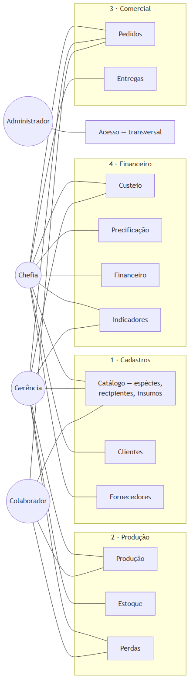
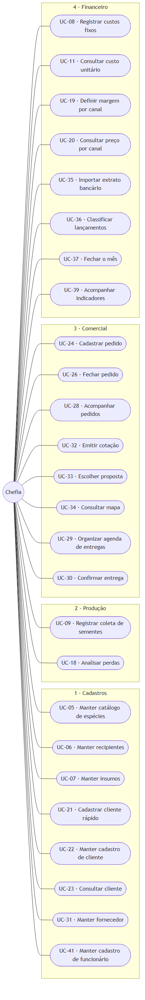
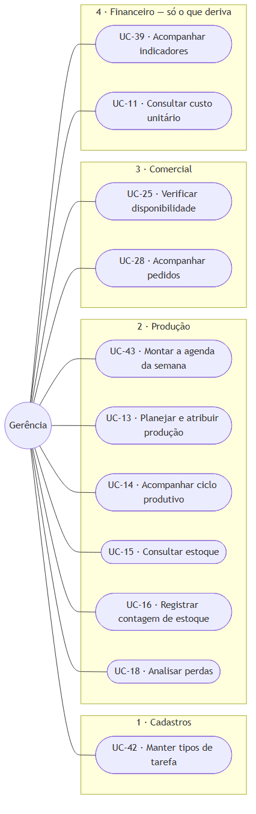
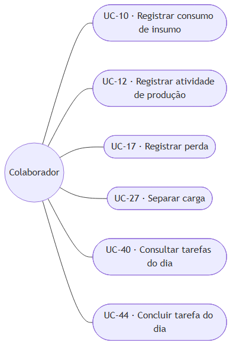
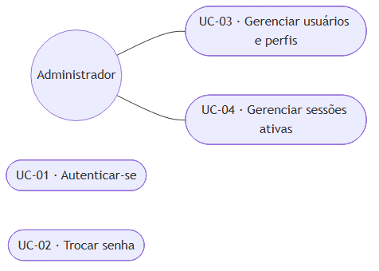

# 4.4 Modelagem do sistema

> Gerado a partir de `C-modelagem/C1-diagrama-casos-de-uso.md`, `C-modelagem/C2-especificacao-casos-de-uso.md`.
> **Não edite este arquivo**: edite o artefato de origem e rode `npm run docs:tcc`.

---

## 1. Atores

Os atores derivam diretamente da estrutura organizacional da empresa. A correspondência entre função
real e papel no sistema é a mesma registrada em
[`A1`](../A-fundacao/A1-documento-de-visao.md) e detalhada em
[`D4`](../D-arquitetura/D4-matriz-rbac.md).

| Ator | Meta ao utilizar o sistema | Nº de pessoas |
|---|---|---|
| **Chefia** | Vender com margem conhecida, decidir com base em dado e não em memória | 1 |
| **Gerência** | Coordenar a operação e saber o que existe, o que falta e o que está por vir | 2 |
| **Colaborador** | Registrar o que fez em campo, com o mínimo de interrupção do trabalho | 6 |
| **Administrador** | Manter o sistema operante e o acesso correto | 1 (acumulado pela gerência) |

**Sobre o administrador:** trata-se de **papel técnico**, não de função da empresa. Ele não participa
de nenhuma rotina de negócio e seus casos de uso limitam-se à gestão de usuários e permissões. É
representado à parte para que os casos de uso de negócio reflitam exclusivamente a operação real do
viveiro.

**Atores externos ao sistema**: sistemas com os quais há troca de informação, sem serem operados por
usuário do viveiro: o **emissor de nota fiscal** (sistema fiscal externo, que recebe os dados da
venda e devolve o número da nota), o **serviço de mensageria** (WhatsApp, por onde a negociação
ocorre) e o **serviço de geocodificação** (que converte cidade e estado do fornecedor em coordenadas).

---

## 2. Visão geral: atores e subsistemas

**Figura 1**: Visão geral: atores e subsistemas. Fonte: elaborado pelo autor (2026).

Os subsistemas estão agrupados nos **quatro módulos** do sistema
(`docs/rotinas/00-mapa-de-rotinas.md`). Acesso fica de fora porque atravessa os quatro.

Três leituras que o diagrama torna imediatas:

- **O colaborador toca quatro subsistemas, sempre pela ponta do registro.** Ele alimenta o sistema e
  não consulta resultado: não acessa preço, custo nem indicador. É o que justifica o rigor dos
  requisitos não funcionais de usabilidade: para esse ator, o sistema **é** o formulário.
- **Custeio e precificação são do Financeiro, não da Produção.** A gerência toca o custeio para
  consultar, mas quem o alimenta é o extrato bancário, e é por isso que o preço do viveiro
  é estimativa enquanto o módulo 4 não rodar.
- **O subsistema Financeiro conecta-se a um único ator.** Não é omissão do diagrama, é regra de
  negócio: a base bancária mistura gasto do viveiro com gasto pessoal da família, e o acesso é
  restrito à chefia. Repare que **o módulo 4 não é restrito por inteiro**: a gerência toca
  Custeio, Precificação e Indicadores, que dele derivam sem o expor. A restrição é do recurso,
  não da porta do módulo ([`D4 §3.2`](../D-arquitetura/D4-matriz-rbac.md)).

---

## 3. Casos de uso por ator

### 3.1 Chefia

**Figura 2**: Chefia. Fonte: elaborado pelo autor (2026).

A concentração é acentuada: **vinte e seis dos quarenta e quatro casos de uso pertencem à chefia.** Não é
falha de distribuição: é o retrato de uma microempresa em que uma única pessoa responde por venda,
preço, compra, finanças e decisão. O sistema não redistribui responsabilidade; ele torna
verificável a que já existe.

### 3.2 Gerência

**Figura 3**: Gerência. Fonte: elaborado pelo autor (2026).

A gerência concentra-se no que **só é possível estando no viveiro**: contar estoque, planejar
produção e verificar disponibilidade. Nenhuma dessas tarefas pode ser executada à distância sem
virar adivinhação registrada como fato: que é precisamente o problema que o sistema existe para
eliminar.

### 3.3 Colaborador

**Figura 4**: Colaborador. Fonte: elaborado pelo autor (2026).

Seis casos de uso, todos de registro ou consulta operacional. É deliberado: cada caso adicional
atribuído a esse ator aumenta a chance de que nenhum seja executado.

### 3.4 Administrador

**Figura 5**: Administrador. Fonte: elaborado pelo autor (2026).

**UC-01** e **UC-02** são comuns a todos os atores e, por isso, não se repetem nos diagramas
anteriores: todo caso de uso do sistema tem como pré-condição uma sessão autenticada.

---

## 4. Catálogo completo de casos de uso

A coluna **requisitos** faz a ligação com [`B2`](../B-requisitos/B2-especificacao-requisitos.md) e
alimenta a matriz de rastreabilidade [`B5`](../B-requisitos/B5-matriz-rastreabilidade.md). A coluna
**módulo** situa cada caso de uso na taxonomia de quatro módulos descrita em
[`00-mapa-de-rotinas`](../../rotinas/00-mapa-de-rotinas.md).

| Código | Caso de uso | Módulo | Ator principal | Requisitos | Detalhado em C2 |
|---|---|---|---|---|---|
| **UC-01** | Autenticar-se | Acesso | Todos | RF-01 | - |
| **UC-02** | Trocar senha | Acesso | Todos | RF-02 | - |
| **UC-03** | Gerenciar usuários e perfis | Acesso | Administrador | RF-05, RF-06 | - |
| **UC-04** | Gerenciar sessões ativas | Acesso | Todos | RF-03, RF-04, RF-07 | - |
| **UC-05** | Manter catálogo de espécies | 1 · Cad. | Chefia | RF-08, RF-09 | - |
| **UC-06** | Manter recipientes | 1 · Cad. | Chefia | RF-10 | - |
| **UC-07** | Manter insumos | 1 · Cad. | Chefia | RF-11 | - |
| **UC-08** | Registrar custos fixos | 4 · Fin. | Chefia | RF-12 | - |
| **UC-09** | Registrar coleta de sementes | 2 · Prod. | Chefia | RF-13 | - |
| **UC-10** | Registrar consumo de insumo | 2 · Prod. | Colaborador | RF-14 | - |
| **UC-11** | Consultar custo unitário | 4 · Fin. | Chefia, Gerência | RF-15, RF-16, RF-17, RF-18 | - |
| **UC-12** | Registrar atividade de produção | 2 · Prod. | Colaborador | RF-19 | - |
| **UC-13** | Planejar e atribuir produção | 2 · Prod. | Gerência | RF-20 | - |
| **UC-14** | Acompanhar ciclo produtivo | 2 · Prod. | Gerência | RF-21 | - |
| **UC-15** | Consultar estoque | 2 · Prod. | Chefia, Gerência | RF-22, RF-24 | - |
| **UC-16** | Registrar contagem de estoque | 2 · Prod. | Gerência | RF-23, RF-25 | - |
| **UC-17** | Registrar perda | 2 · Prod. | Colaborador | RF-26 | **✔ sim** |
| **UC-18** | Analisar perdas | 2 · Prod. | Gerência, Chefia | RF-27, RF-28, RF-29, RF-30 | - |
| **UC-19** | Definir margem por canal | 4 · Fin. | Chefia | RF-31 | - |
| **UC-20** | Consultar preço por canal | 4 · Fin. | Chefia, Gerência | RF-32, RF-33, RF-34, RF-35 | - |
| **UC-21** | Cadastrar cliente rápido | 1 · Cad. | Chefia | RF-36 | - |
| **UC-22** | Manter cadastro completo de cliente | 1 · Cad. | Chefia | RF-37, RF-38, RF-40 | - |
| **UC-23** | Consultar cliente | 1 · Cad. | Chefia | RF-39 | - |
| **UC-24** | Cadastrar pedido | 3 · Com. | Chefia | RF-41, RF-66, RF-67 | **✔ sim** |
| **UC-25** | Verificar disponibilidade | 3 · Com. | Gerência | RF-42, RF-43, RF-68 | **✔ sim** |
| **UC-26** | Fechar pedido | 3 · Com. | Chefia | RF-44, RF-45, RF-46 | **✔ sim** |
| **UC-27** | Separar carga | 3 · Com. | Colaborador | RF-47 | **✔ sim** |
| **UC-28** | Acompanhar pedidos | 3 · Com. | Chefia, Gerência | RF-48, RF-49 | - |
| **UC-29** | Organizar agenda de entregas | 3 · Com. | Chefia | RF-50 | - |
| **UC-30** | Confirmar entrega | 3 · Com. | Chefia | RF-51 | - |
| **UC-31** | Manter fornecedor | 1 · Cad. | Chefia | RF-52 | - |
| **UC-32** | Emitir cotação | 3 · Com. | Chefia | RF-53 | **✔ sim** |
| **UC-33** | Escolher proposta | 3 · Com. | Chefia | RF-54 | **✔ sim** |
| **UC-34** | Consultar mapa de fornecedores | 3 · Com. | Chefia | RF-55 | - |
| **UC-35** | Importar extrato bancário | 4 · Fin. | Chefia | RF-56 | - |
| **UC-36** | Classificar lançamentos | 4 · Fin. | Chefia | RF-57, RF-58, RF-59 | **✔ sim** |
| **UC-37** | Fechar o mês | 4 · Fin. | Chefia | RF-60, RF-61 | - |
| **UC-38** | Consultar faturamento | 4 · Fin. | Chefia | RF-61, RF-62 | - |
| **UC-39** | Acompanhar indicadores | 4 · Fin. | Chefia, Gerência | RF-63, RF-64, RF-65 | - |
| **UC-40** | Consultar tarefas do dia | 2 · Prod. | Colaborador | RF-74 | - |
| **UC-41** | Manter cadastro de funcionário | 1 · Cad. | Chefia | RF-69 | - |
| **UC-42** | Manter catálogo de tipos de tarefa | 1 · Cad. | Gerência | RF-70 | - |
| **UC-43** | Montar a agenda da semana | 2 · Prod. | Gerência | RF-71, RF-72, RF-73, RF-75 | - |
| **UC-44** | Concluir tarefa do dia | 2 · Prod. | Colaborador | RF-74 | - |

**44 casos de uso.** Os oito marcados são especificados em detalhe em
[`C2`](C2-especificacao-casos-de-uso.md): são os que concentram fluxos alternativos e exceções, e
aqueles cujo erro tem maior custo operacional.

---
## 5. Nota sobre a notação

O Mermaid, empregado para versionar os diagramas em texto junto ao código, não implementa a notação
UML de caso de uso (ator como figura de palito, caso como elipse, sistema como retângulo delimitador).
Os diagramas acima representam **atores como círculos** e **casos de uso como formas arredondadas**,
preservando a semântica (ator, caso, associação e fronteira de subsistema) ainda que não a
representação gráfica canônica.

As figuras publicadas no trabalho são geradas em notação UML padrão a partir do mesmo conteúdo, e
ficam em [`../word/img/`](../word/img/).

---

## Como ler

Oito casos de uso, dos quarenta catalogados em [`C1`](C1-diagrama-casos-de-uso.md), estão
especificados aqui. O critério de seleção foi duplo: **concentração de fluxos alternativos** e
**custo operacional do erro**. Cadastrar um insumo errado corrige-se em segundos; separar a carga
errada põe um caminhão na estrada com a muda errada.

Todos têm como pré-condição comum uma **sessão autenticada** cujo perfil autoriza a operação, a
verificação ocorre a cada ação, e não apenas na entrada da tela (RF-06).

Notação dos fluxos: **FP** fluxo principal, **FA** fluxo alternativo, **FE** fluxo de exceção.

---

## UC-24 · Cadastrar pedido

| | |
|---|---|
| **Ator principal** | Chefia |
| **Objetivo** | Registrar no sistema um pedido já negociado por WhatsApp, antes que o detalhe se perca |
| **Requisitos** | RF-41, RF-66, RF-67, RF-36 |
| **Frequência** | Diária |
| **Pré-condições** | Existe ao menos uma espécie e um recipiente cadastrados |
| **Pós-condições** | Pedido criado no estado *cadastrado*, com ao menos um item; gerência notificada |

### FP: Fluxo principal

1. A chefia inicia o cadastro de um novo pedido.
2. O sistema solicita o cliente.
3. A chefia seleciona um cliente existente.
4. O sistema solicita o canal de venda e apresenta *atacado* como opção padrão.
5. A chefia confirma ou altera o canal.
6. A chefia adiciona um item informando espécie, recipiente e quantidade.
7. O sistema valida que a quantidade é positiva e acrescenta o item ao pedido.
8. A chefia repete os passos 6 e 7 para os demais itens.
9. A chefia informa, opcionalmente, a data prevista de entrega e observações.
10. A chefia conclui o cadastro.
11. O sistema registra o pedido no estado *cadastrado*, atribui-lhe número sequencial e notifica a gerência de que há disponibilidade a verificar.

### FA-1: Cliente ainda não cadastrado

No passo 3, a chefia não localiza o cliente.

1. A chefia aciona o cadastro rápido sem sair da tela de pedido.
2. O sistema solicita apenas **nome e telefone**.
3. O sistema cria o cliente e o seleciona no pedido, retornando ao passo 4.

> O cadastro fiscal completo não é exigido aqui. Exigi-lo interromperia a única
> etapa do processo que compete com uma conversa de WhatsApp em andamento: a complementação ocorre
> no fechamento, e apenas se houver nota fiscal a emitir (UC-26, FA-1).

### FA-2: Item genérico

No passo 6, o cliente não especificou as espécies, pediu quantidade e porte.

1. A chefia marca o item como **genérico** e informa recipiente e quantidade, sem espécie.
2. O sistema, opcionalmente, aceita a lista de espécies que o cliente admite.
3. O sistema, opcionalmente, aceita a especificação de qualidade em texto livre.
4. O sistema registra o item genérico e retorna ao passo 8.

> Item genérico sem lista de espécies significa **aberto**: qualquer espécie o atende. É o caso
> corrente em compensação ambiental, onde a exigência é de quantidade e diversidade, não de espécies
> nomeadas.

### FE-1: Quantidade inválida

No passo 7, a quantidade informada é zero ou negativa. O sistema recusa o item, informa o motivo e
mantém o pedido em edição, sem perder os itens já lançados.

---

## UC-25 · Verificar disponibilidade

| | |
|---|---|
| **Ator principal** | Gerência |
| **Objetivo** | Conferir, contra o estoque físico, se o pedido pode ser atendido |
| **Requisitos** | RF-42, RF-43, RF-68 |
| **Frequência** | Diária |
| **Pré-condições** | Pedido no estado *cadastrado* |
| **Pós-condições** | Cada item classificado como disponível, parcial ou indisponível; pedido em *verificado*; chefia notificada |

### FP: Fluxo principal

1. A gerência abre um pedido pendente de verificação.
2. O sistema apresenta os itens em formato de lista de conferência, com espécie, recipiente e quantidade pedida.
3. O sistema registra o pedido como *verificando disponibilidade*.
4. Para cada item, a gerência confirma que há quantidade suficiente.
5. O sistema marca o item como **disponível**.
6. Concluídos todos os itens, a gerência encerra a verificação.
7. O sistema registra o pedido como *verificado* e notifica a chefia.

### FA-1: Disponibilidade parcial

No passo 4, existe menos do que o pedido.

1. A gerência informa a **quantidade efetivamente disponível**.
2. O sistema valida que o valor está entre 1 e a quantidade pedida.
3. O sistema marca o item como **parcial**, preservando as duas quantidades, e retorna ao passo 4.

### FA-2: Disponível em outro recipiente

No passo 4, a espécie existe, mas em recipiente diferente do pedido.

1. A gerência informa a quantidade disponível e **qual recipiente** de fato existe.
2. O sistema registra ambos e retorna ao passo 4.

> Trata-se de negociação, não de erro: um cliente que pediu saco 17x22 frequentemente aceita 20x26
> por outro preço. Reduzir esse caso a "indisponível" descartaria uma venda que ocorreria.

### FA-3: Item indisponível

No passo 4, não há nenhuma unidade. A gerência informa quantidade zero, o sistema marca o item como
**indisponível** e retorna ao passo 4. O pedido segue: a decisão de cancelar, substituir ou cotar com
fornecedor cabe à chefia (UC-26) ou origina uma cotação (UC-32).

### FA-4: Item genérico

No passo 4, o item não tem espécie definida. A gerência indica as espécies com que pretende atendê-lo,
respeitada a lista de espécies aceitas quando houver. O sistema valida a restrição e retorna ao passo 4.

### FE-1: Espécie fora da lista aceita

Em FA-4, a espécie escolhida não consta da lista definida pelo cliente. O sistema recusa a escolha e
informa quais espécies são aceitas.

---

## UC-26 · Fechar pedido

| | |
|---|---|
| **Ator principal** | Chefia |
| **Objetivo** | Decidir sobre o pedido verificado, aprovar preço e liberá-lo para separação |
| **Requisitos** | RF-44, RF-45, RF-46, RF-40, RF-33 |
| **Frequência** | Diária |
| **Pré-condições** | Pedido no estado *verificado* |
| **Pós-condições** | Pedido *aprovado*, carga de separação criada, colaboradores notificados |

### FP: Fluxo principal

1. A chefia abre um pedido verificado.
2. O sistema apresenta a análise: itens disponíveis, parciais e indisponíveis, com as quantidades de cada caso.
3. O sistema apresenta, por item, o preço sugerido do canal de venda do pedido.
4. A chefia confirma ou ajusta o preço de cada item.
5. O sistema valida que nenhum preço está abaixo do piso mínimo.
6. A chefia informa se o pedido exige nota fiscal.
7. A chefia aprova o pedido.
8. O sistema registra o pedido como *aprovado*, gera a carga de separação com os itens e quantidades aprovados, e notifica os colaboradores.

### FA-1: Nota fiscal exigida e cliente com cadastro incompleto

No passo 6, a chefia indica que há nota a emitir, mas o cliente possui apenas nome e telefone.

1. O sistema sinaliza a pendência e solicita os dados fiscais, tipo de pessoa, documento, razão social quando pessoa jurídica, endereço.
2. A chefia completa os dados **na própria tela de fechamento**.
3. O sistema valida o documento informado e retorna ao passo 7.

### FA-2: Atendimento parcial aceito

No passo 4, há itens parciais e a chefia decide faturar o que existe.

1. A chefia confirma as quantidades disponíveis como quantidades aprovadas.
2. O sistema registra a diferença e retorna ao passo 7.

### FA-3: Complementação por fornecedor

No passo 2, há itens indisponíveis que a chefia decide comprar de terceiro. O caso de uso é suspenso
e origina uma cotação (UC-32). O pedido permanece *verificado* até que a cotação se resolva.

### FE-1: Preço abaixo do piso mínimo

No passo 5, o preço informado é inferior ao piso. O sistema **recusa** a aprovação, indica o piso
aplicável e mantém o pedido em edição.

> O piso é bloqueio, não alerta. A regra existe justamente porque a venda com prejuízo hoje ocorre
> sem que ninguém perceba: um aviso que pode ser ignorado não altera esse quadro.

### FE-2: Documento fiscal inválido

Em FA-1, o CPF ou CNPJ informado não é válido. O sistema recusa o dado no momento da digitação e
indica o erro, sem descartar os demais campos já preenchidos.

---

## UC-27 · Separar carga

| | |
|---|---|
| **Ator principal** | Colaborador |
| **Objetivo** | Recolher fisicamente as mudas da carga e registrar o que foi separado |
| **Requisitos** | RF-47 |
| **Frequência** | Diária |
| **Pré-condições** | Existe carga no estado *pendente* |
| **Pós-condições** | Carga *pronta*; pedido em *pronto para envio*; chefia notificada |

### FP: Fluxo principal

1. O colaborador abre a lista de cargas a separar.
2. O sistema apresenta os itens da carga com espécie, recipiente e quantidade, em lista de conferência.
3. O sistema registra a carga como *separando*.
4. O colaborador separa fisicamente um item e o marca como separado.
5. O sistema registra a marcação e apresenta confirmação visual imediata.
6. O colaborador repete os passos 4 e 5 até o último item.
7. O sistema registra a carga como *pronta*, atualiza o pedido para *pronto para envio* e notifica a chefia.

### FA-1: Sem conexão

Nos passos 4 e 5, o dispositivo está sem rede.

1. O sistema registra a marcação localmente e confirma ao colaborador.
2. O sistema envia os registros pendentes assim que a conexão se restabelece.

> Este fluxo alternativo é o mais executado de todos os aqui descritos, e não a exceção: a área de
> separação é onde a conexão falha com mais frequência. Um sistema que exija rede nesse ponto será
> substituído por papel no primeiro dia.

### FA-2: Divergência entre carga e estoque físico

No passo 4, o item não existe na quantidade indicada. O colaborador registra a quantidade
efetivamente separada, e o sistema notifica a gerência da divergência para nova verificação.

---

## UC-17 · Registrar perda

| | |
|---|---|
| **Ator principal** | Colaborador |
| **Objetivo** | Registrar mudas perdidas no momento e no local em que a perda é constatada |
| **Requisitos** | RF-26, RF-28, RF-29 |
| **Frequência** | Diária |
| **Pré-condições** | Nenhuma além da sessão autenticada |
| **Pós-condições** | Perda registrada; mortalidade da espécie recalculada; alerta emitido se ultrapassar o limite |

### FP: Fluxo principal

1. O colaborador aciona o registro de perda.
2. O sistema apresenta um formulário de **quatro campos**: espécie, recipiente, quantidade e causa.
3. O colaborador seleciona a espécie.
4. O colaborador seleciona o recipiente.
5. O colaborador informa a quantidade perdida.
6. O colaborador seleciona a causa em lista fechada, seca, praga, geada, manuseio ou outro.
7. O colaborador confirma.
8. O sistema grava a perda, exibe confirmação visual e retorna ao formulário vazio, pronto para o próximo registro.
9. O sistema recalcula a taxa de mortalidade da espécie no período.

### FA-1: Mortalidade acima do limite

No passo 9, a taxa recalculada ultrapassa 20%. O sistema emite alerta à gerência identificando
espécie, taxa e causa predominante. **O colaborador não é interrompido**: o alerta é dirigido a quem
pode agir sobre ele.

### FA-2: Sem conexão

Nos passos 7 e 8, não há rede. O sistema grava localmente, confirma ao colaborador e envia ao
restabelecer a conexão. O recálculo do passo 9 ocorre na sincronização.

### FE-1: Quantidade inválida

No passo 5, a quantidade é zero, negativa ou não numérica. O sistema recusa, indica o campo e
preserva os demais já preenchidos.

> **Nota de projeto.** O formulário tem quatro campos, e não cinco, embora o limite permitisse mais
> um. Registrar o local da perda dentro do viveiro melhoraria a análise, e foi descartado: seria o
> campo que faria o colaborador deixar de registrar. Ver o conflito documentado em
> [`B2`, seção 5](../B-requisitos/B2-especificacao-requisitos.md).

---

## UC-32 · Emitir cotação

| | |
|---|---|
| **Ator principal** | Chefia |
| **Objetivo** | Consultar preço e disponibilidade junto a fornecedores para o que a produção própria não atende |
| **Requisitos** | RF-53 |
| **Frequência** | Semanal |
| **Pré-condições** | Existe ao menos um fornecedor cadastrado e apto a ser contatado |
| **Pós-condições** | Uma cotação por fornecedor, agrupadas sob a mesma consulta, no estado *na fila* |

### FP: Fluxo principal

1. A gerência inicia uma cotação, opcionalmente vinculada a um pedido de cliente.
2. A gerência informa os itens: espécie, quantidade e tamanho desejado.
3. O sistema sugere os fornecedores que declaram fornecer aquelas espécies.
4. A gerência seleciona os fornecedores a consultar.
5. O sistema compõe a mensagem de consulta e a apresenta para revisão.
6. A gerência revisa e ajusta o texto.
7. A gerência confirma.
8. O sistema cria uma cotação por fornecedor, todas vinculadas à mesma consulta, e registra o texto enviado.
9. A gerência aciona o envio a cada fornecedor pelo canal escolhido.

### FA-1: Cotação avulsa

No passo 1, a gerência não vincula a cotação a pedido algum, é sondagem de mercado ou reposição de
estoque. O fluxo segue idêntico, sem o vínculo.

### FE-1: Fornecedor que solicitou não ser contatado

No passo 4, um fornecedor selecionado está marcado como *não contatar*. O sistema **o exclui da
seleção** e informa o motivo.

> O envio é sempre ação manual do usuário, nunca disparo automático do sistema. Essa decisão é de
> conformidade, não de conveniência: aliada à marcação de *não contatar*, sustenta o direito de
> oposição previsto na legislação de proteção de dados, ver
> [`E5`](../E-qualidade/E5-mapeamento-lgpd.md).

---

## UC-33 · Escolher proposta

| | |
|---|---|
| **Ator principal** | Chefia |
| **Objetivo** | Comparar as respostas recebidas e definir de quem comprar cada espécie |
| **Requisitos** | RF-54, RF-33 |
| **Frequência** | Semanal |
| **Pré-condições** | Existe consulta com ao menos duas respostas registradas |
| **Pós-condições** | Uma proposta escolhida por espécie; preço de revenda definido |

### FP: Fluxo principal

1. A gerência registra as respostas recebidas, informando preço unitário e observações por item.
2. O sistema marca as cotações respondidas e apresenta o comparativo por espécie, com os fornecedores lado a lado.
3. A chefia escolhe, para cada espécie, a proposta vencedora.
4. O sistema registra a escolha, admitindo **uma única** por espécie dentro da consulta.
5. A chefia define o preço de revenda ao cliente.
6. O sistema valida o preço contra o piso mínimo.
7. O sistema registra o preço de revenda.

### FA-1: Fornecedor sem resposta

No passo 1, decorrido o prazo, um fornecedor não respondeu. A gerência marca a cotação como *sem
retorno*, e ela é excluída do comparativo sem ser apagada: o histórico de quem responde alimenta o
grau de confiabilidade do fornecedor.

### FE-1: Preço de revenda abaixo do piso

No passo 6, o preço informado não cobre o custo de aquisição acrescido da margem mínima. O sistema
recusa e apresenta o piso aplicável.

---

## UC-36 · Classificar lançamentos

| | |
|---|---|
| **Ator principal** | Chefia |
| **Objetivo** | Atribuir significado aos lançamentos importados do extrato, enquanto a memória do gasto ainda existe |
| **Requisitos** | RF-57, RF-58, RF-59 |
| **Frequência** | Semanal |
| **Pré-condições** | Existem lançamentos importados e não classificados |
| **Pós-condições** | Fila reduzida; classificações convertidas em regra para os meses seguintes |

### FP: Fluxo principal

1. A chefia abre a fila de lançamentos pendentes.
2. O sistema apresenta os lançamentos que **não** reconheceu, com data, valor e descrição do banco.
3. Para cada lançamento, a chefia informa centro de custo, categoria e contraparte, todos em lista fechada.
4. O sistema registra a classificação e a converte em regra para lançamentos equivalentes futuros.
5. O sistema remove o lançamento da fila.
6. A chefia repete até esvaziar a fila.

### FA-1: Competência distinta da movimentação

No passo 3, o gasto pertence economicamente a outro mês, insumo comprado em fevereiro e pago em
abril.

1. A chefia informa a **data de competência**.
2. O sistema registra as duas datas, e o custeio passa a considerar a competência.

> Sem essa distinção, o mês de semeadura pesada aparece barato e o mês do pagamento aparece caro.
> e o custo por muda mente nos dois.

### FA-2: Gasto que serve a mais de um centro de custo

No passo 3, o lançamento é compartilhado: a energia de um imóvel que abriga casa e clínica. A chefia
divide o valor entre centros, e o sistema valida que a soma das partes iguala o total.

### FA-3: Lançamento já reconhecido

No passo 2, o sistema identifica lançamento equivalente a outro já classificado, aplica a
classificação automaticamente e o mantém fora da fila.

### FE-1: Mês já fechado

No passo 3, o lançamento pertence a mês travado. O sistema recusa a alteração e informa que é
necessário reabrir o período.

---

## Casos de uso não especificados

Os trinta e dois casos restantes de [`C1`](C1-diagrama-casos-de-uso.md) são operações de manutenção
de cadastro e de consulta, cujo fluxo se resume a selecionar, preencher e confirmar, sem alternativas
relevantes. Especificá-los produziria repetição sem ganho analítico.

Dois merecem registro por já estarem descritos em linguagem de negócio na documentação de domínio:
**UC-35 (importar extrato)** e **UC-37 (fechar o mês)**, ambos em
[`docs/rotinas/4-financeiro/`](../../rotinas/4-financeiro/).

