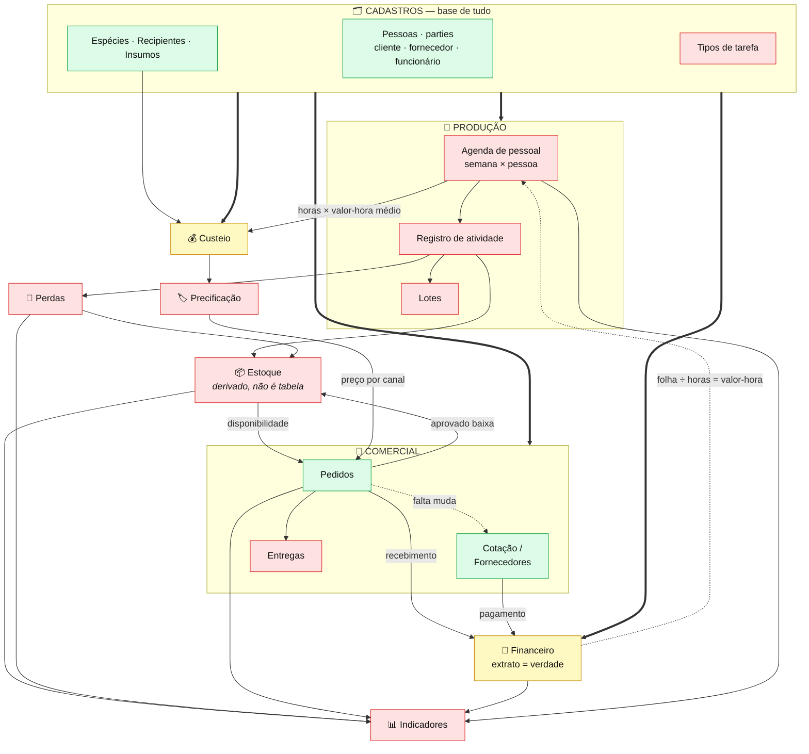
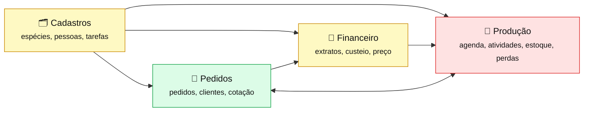

# Mapa de Rotinas

## Perfis

| Perfil | Quem | Foco |
|--------|------|------|
| **Chefia** | Gilberto | Vendas, finanças, decisões, entregas |
| **Gerência** | Débora, João | Operação, coordenação, estoque, tarefas |
| **Colaborador** | Rogério, Amélia, Jaison, Mathias, Santilha, Carolayne | Execução no campo |

---

## Como as rotinas se relacionam

🟩 pronto · 🟨 começado · 🟥 não existe ainda

**Três leituras que o diagrama torna imediatas:**

- **Cadastros não consome nada e alimenta todo mundo.** É por isso que ele é rotina própria
  e não um canto do `/admin`.
- **A agenda de pessoal é o elo que falta no dinheiro.** Ela é a única fonte possível de
  horas — sem ela, custeio e precificação continuam sendo estimativa.
- **O único ciclo fechado é financeiro → agenda → custeio → preço → pedido → financeiro.**
  Quebrar qualquer elo desse anel faz o preço voltar a ser chute.

---

## Visão do dono: as 4 áreas

---

## 1. Cadastros — cadastro único (`rotina-cadastros.md`)

Rotina **agrupadora**, sem processo próprio. Reúne o que é estável e se repete.

| Etapa | Perfil |
|-------|--------|
| Cadastrar/editar espécie, recipiente, insumo | Gerência |
| Cadastrar/editar cliente | Chefia / Gerência |
| Cadastrar/editar fornecedor | Chefia |
| Cadastrar/editar funcionário | Chefia |
| Cadastrar/editar tipo de tarefa | Gerência |

## 2. Produção (`rotina-producao/`)

Absorve a antiga rotina de Tarefas Diárias.

| Etapa | Perfil |
|-------|--------|
| Montar a agenda da semana | Gerência |
| Ver minhas tarefas de hoje / concluir | Colaborador |
| Registro de atividade (semeadura, repicagem, irrigação, adubação) | Colaborador |
| Acompanhamento de lotes e de execução | Gerência |
| Visão de produção e custo de mão de obra | Chefia |

## 3. Pedidos (`rotina-pedidos.md`)

| Etapa | Perfil |
|-------|--------|
| Cadastro de pedido (recebe via WhatsApp) | Chefia |
| Verificação de disponibilidade (checklist) | Gerência |
| Aprovação de venda / preço | Chefia |
| Lista de pedidos a organizar | Gerência |
| Separação física das mudas | Colaborador |

## 4. Clientes (`rotina-clientes.md`)

| Etapa | Perfil |
|-------|--------|
| Cadastro rápido (nome + telefone, inline no pedido) | Chefia |
| Cadastro/edição completa (dados fiscais PF/PJ) na área `/clientes` | Chefia / Gerência |
| Definir se o pedido precisa de Nota Fiscal (no fechamento) | Chefia |
| Complementação fiscal inline quando o cliente está incompleto | Chefia |
| Consulta/busca de clientes | Chefia / Gerência |

## 5. Estoque (`rotina-estoque.md`)

| Etapa | Perfil |
|-------|--------|
| Visão geral de estoque por espécie | Chefia |
| Contagem e atualização de estoque | Gerência |
| Alerta de estoque baixo | Gerência |

## 6. Perdas (`rotina-perdas.md`)

| Etapa | Perfil |
|-------|--------|
| Registro de perda no campo | Colaborador |
| Análise de perdas por espécie/causa | Gerência |
| Relatório consolidado de perdas | Chefia |

## 7. Entregas (`rotina-entregas.md`)

| Etapa | Perfil |
|-------|--------|
| Agenda de entregas / roteiro | Chefia |
| Preparação de carga (checklist) | Gerência |
| Carregamento físico | Colaborador |
| Confirmação de entrega | Chefia |

## 8. Financeiro (`rotina-financeiro.md` + pasta `rotina-financeiro/`)

O acesso a `/financeiro` é **exclusivo de chefia/admin** — a base mistura gasto do viveiro
com gasto pessoal da família e da clínica.

| Etapa | Perfil |
|-------|--------|
| Classificar a fila de lançamentos (semanal, sexta — centro, categoria, contraparte) | Chefia |
| Importar extrato bancário (mensal, dia 1) | Chefia |
| Fechar o mês (conferir saldo × extrato e travar) | Chefia |
| Emissão de nota fiscal (sistema do Sebrae; app registra o número) | Chefia |
| Visão de faturamento (só sobre mês fechado) | Chefia |
| Consulta de preço por espécie/canal | Gerência |

---

> **Rotina de Tarefas Diárias:** absorvida pela Produção. `rotina-tarefas.md` permanece
> apenas como registro histórico.
