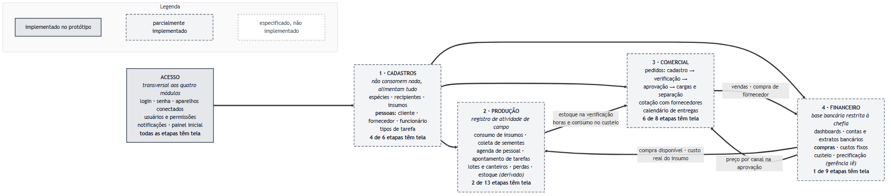
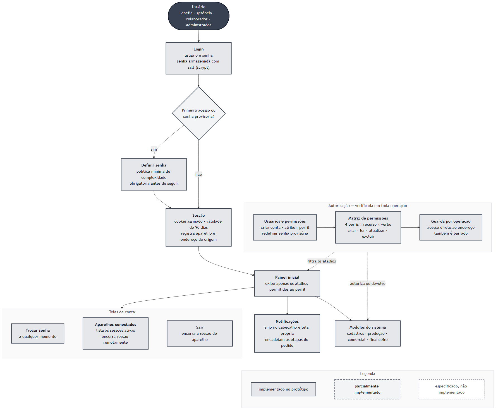
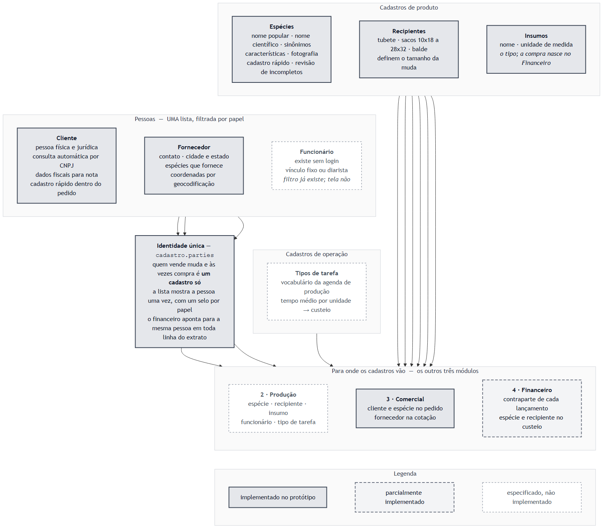
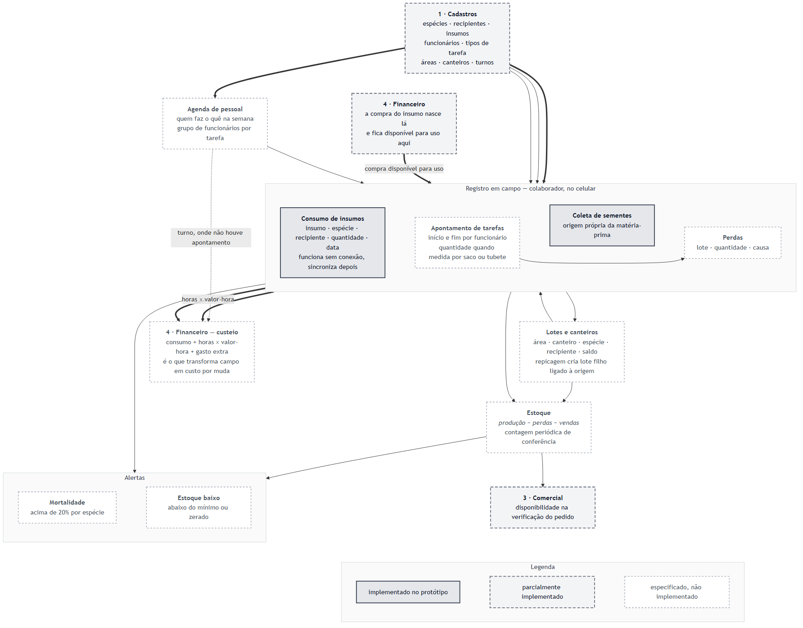
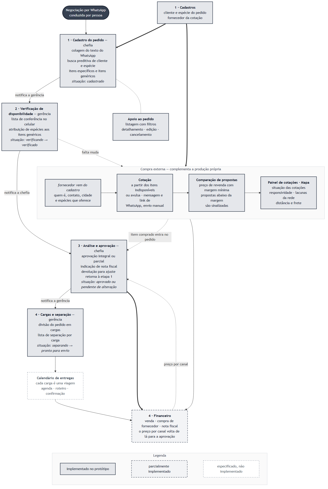
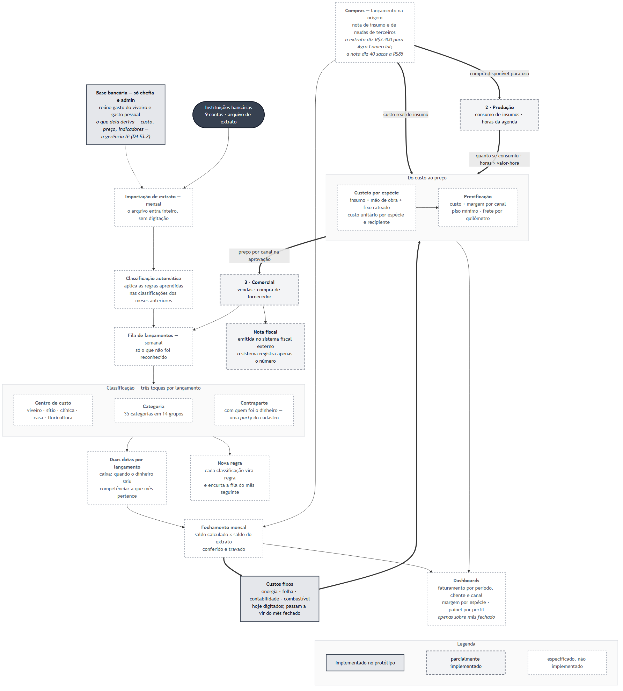

# Mapa de Rotinas

> **O sistema tem quatro módulos**: Cadastros, Produção, Comercial, Financeiro.
> Acesso (login, senha, aparelhos, usuários, notificações) é **transversal** — atravessa os
> quatro e não é módulo de negócio.
>
> Esta é a taxonomia única. Ela está espelhada em três lugares que não podem divergir:
> os diagramas desta página, `src/lib/modules.ts` (a navegação do app) e os comentários de
> seção de `src/lib/permissions.ts` (a matriz do D4). O teste
> `src/lib/__tests__/modules.test.ts` quebra se a navegação sair de linha.

## Perfis

| Perfil | Quem | Foco |
|--------|------|------|
| **Chefia** | Gilberto | Vendas, finanças, decisões, entregas |
| **Gerência** | Débora, João | Operação, coordenação, estoque, tarefas |
| **Colaborador** | Rogério, Amélia, Jaison, Mathias, Santilha, Carolayne | Execução no campo |

---

## Como os quatro módulos se relacionam



🟩 pronto · 🟨 começado · 🟥 não existe ainda

**Três leituras que o diagrama torna imediatas:**

- **Cadastros não consome nada e alimenta todo mundo.** É o único módulo sem entrada. Por
  isso é rotina própria, e não um canto do `/admin`.
- **O fluxo entre os módulos é um ciclo, não uma fila.** A compra nasce no Financeiro e volta
  para a Produção; o consumo e as horas voltam para o custeio; o preço volta para o Comercial
  na hora de aprovar. Quebrar qualquer elo faz o preço voltar a ser chute.
- **Estoque não é tabela.** É produção menos perdas menos vendas; por isso mora na Produção,
  como resultado, e não em Cadastros.

### O ciclo do dinheiro

O único anel fechado do sistema — hoje quebrado na agenda de pessoal, que é a única fonte
possível de horas. Sem ela, custeio e precificação continuam sendo estimativa.


### A visão do dono


<details>
<summary>Fonte dos diagramas (Mermaid)</summary>

Os arquivos `.mmd` ficam em [`img/`](img/). Para regenerar um PNG:

```bash
npx -y @mermaid-js/mermaid-cli -i docs/rotinas/img/mapa-sistema-v2.mmd \
  -o docs/rotinas/img/mapa-sistema-v2.png -w 1600 -b white
```

O PNG é a fonte para leitura e para o TCC; o `.mmd` é a fonte para edição.

`img/mapa-sistema.mmd` é a versão anterior, de seis blocos, mantida só como registro do que
o mapa dizia antes da reconciliação.

</details>

---

## 0 · Acesso — transversal



Login, definição e troca de senha, aparelhos conectados, usuários e permissões, notificações
e painel inicial. Não é módulo de negócio: guarda os quatro.

Telas em `/login`, `/trocar-senha`, `/conta/sessoes`, `/notificacoes` e `/admin/usuarios`.
`/admin` ficou **só** com administração de sistema — usuários e sessões.

---

## 1 · Cadastros (`rotina-cadastros.md`)



Rotina **agrupadora**, sem processo próprio. Reúne o que é estável e se repete.

> **Regra de corte: é cadastro se, ao apagá-lo, um movimento passado ficar sem sentido.**

| Etapa | Perfil |
|-------|--------|
| Cadastrar/editar espécie, recipiente, insumo | Gerência |
| Consultar pessoas por papel (`/cadastros/pessoas`) | Chefia / Gerência |
| Cadastrar/editar cliente (`rotina-clientes.md`) | Chefia / Gerência |
| Cadastrar/editar fornecedor | Chefia |
| Cadastrar/editar funcionário | Chefia |
| Cadastrar/editar tipo de tarefa | Gerência |

**Pessoas são uma identidade só.** Cliente, fornecedor e funcionário são papéis de
`cadastro.parties` — quem vende muda e às vezes compra é um cadastro só. Por isso
`/cadastros/pessoas` é **uma lista com filtro por papel**, e não uma aba por papel: a pessoa
aparece uma vez, com um selo por papel que leva à tela daquele papel. O nome abre a **ficha**
(`/cadastros/pessoas/[id]`), com o histórico dos dois lados — é onde o *quanto compramos e
quanto vendemos* vai aparecer quando o Financeiro existir.

Os papéis vêm filtrados do servidor pelo que o usuário pode ler — `fornecedor:ler` é só de
chefia e admin, então a gerência não vê a rede de fornecedores nem de relance. Funcionário
é filtro sem tela até o P13 T13.3/T13.7.

Área `/cadastros`. As telas de papel mantiveram as URLs antigas (`/clientes`,
`/fornecedores`) porque a rotina de pedidos aponta para elas e `notifications.link` guarda
caminho gravado no banco; o agrupamento é de navegação, não de rota.

## 2 · Produção (`rotina-producao/`)



Registro de atividade de campo. Absorve a antiga rotina de Tarefas Diárias e recebe do
Financeiro as compras que ficam disponíveis para uso.

| Etapa | Perfil |
|-------|--------|
| Registrar consumo de insumo (funciona offline) | Colaborador |
| Registrar coleta de sementes | Gerência |
| Montar a agenda da semana | Gerência |
| Ver minhas tarefas de hoje / concluir | Colaborador |
| Registro de atividade (semeadura, repicagem, irrigação, adubação) | Colaborador |
| Acompanhamento de lotes e de execução | Gerência |
| Registro de perda no campo (`rotina-perdas.md`) | Colaborador |
| Análise de perdas por espécie/causa | Gerência |
| Visão geral de estoque por espécie (`rotina-estoque.md`) | Chefia |
| Contagem e atualização de estoque | Gerência |

Área `/producao`.

## 3 · Comercial (`rotina-pedidos/`, `rotina-entregas.md`)



| Etapa | Perfil |
|-------|--------|
| Cadastro de pedido (recebe via WhatsApp) | Chefia |
| Verificação de disponibilidade (checklist) | Gerência |
| Aprovação de venda / preço | Chefia |
| Cargas e separação física das mudas | Colaborador |
| Cotação com fornecedor quando falta muda | Chefia |
| Comparação de propostas e escolha | Chefia |
| Agenda de entregas / roteiro | Chefia |
| Confirmação de entrega | Chefia |

Área `/comercial`; as telas continuam em `/pedidos` e `/fornecedores/*`.

## 4 · Financeiro (`rotina-financeiro/`)



O acesso é **exclusivo de chefia/admin** — a base mistura gasto do viveiro com gasto pessoal
da família e da clínica.

| Etapa | Perfil |
|-------|--------|
| Lançar compra (nota de insumo, mudas de terceiros) | Chefia |
| Classificar a fila de lançamentos (semanal, sexta) | Chefia |
| Importar extrato bancário (mensal, dia 1) | Chefia |
| Fechar o mês (conferir saldo × extrato e travar) | Chefia |
| Manter custos fixos | Chefia |
| Emissão de nota fiscal (sistema do Sebrae; app registra o número) | Chefia |
| Ver dashboards de faturamento e margem (só sobre mês fechado) | Chefia |
| Consulta de preço por espécie/canal | Gerência |

Área `/financeiro`. **É aqui que a compra nasce** — e é de onde ela fica disponível para a
Produção usar.

---

> **Rotina de Tarefas Diárias:** absorvida pela Produção. `rotina-tarefas.md` permanece
> apenas como registro histórico.
